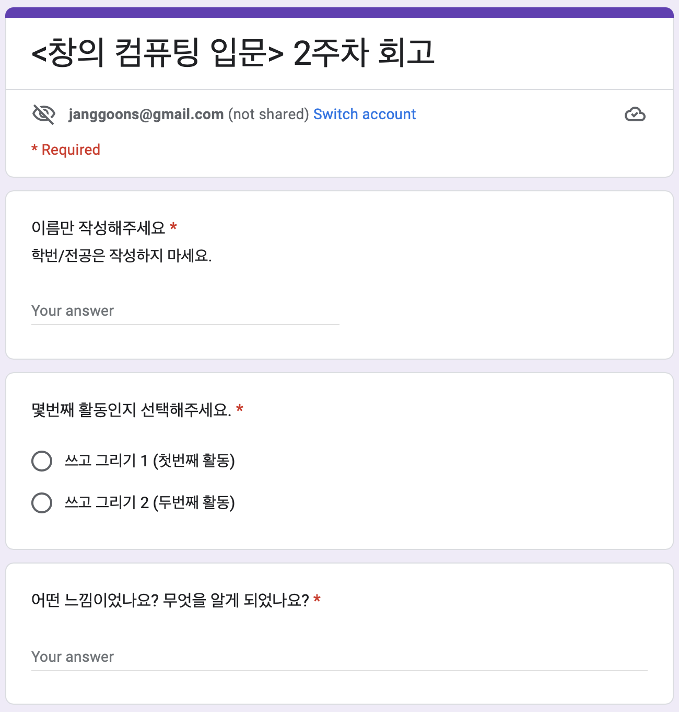
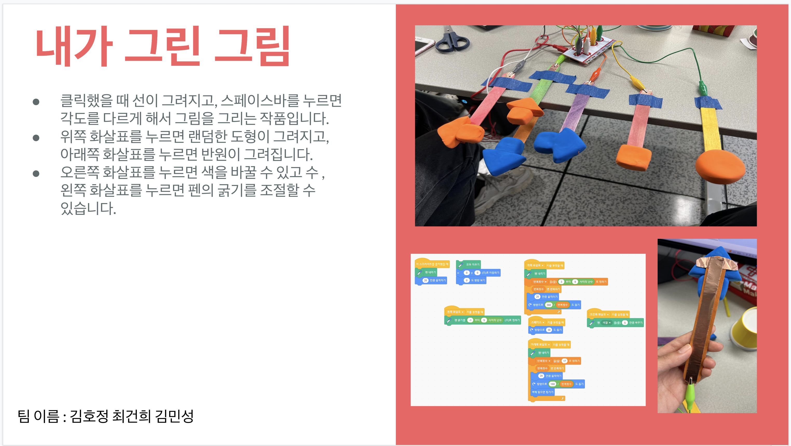

<!--
_class: lead
-->
# **창의 컴퓨팅 입문**
###### Week 01 : 오리엔테이션

---
## 목차
* 교강사 소개
* 수업 소개
* 수업의 내용과 방향
* 평가 방법

---
## 교강사 소개
* 장윤재 [소개 웹페이지](https://sites.google.com/view/janggoons/home)
  - 대학에서 "컴퓨터교육학" 전공
  - "컴퓨팅"으로 이해하고 만들어 보는 것을 가르치고 배우기
  - 초보자를 위한 "컴퓨팅 교육"
  - 컴퓨팅을 가르치는 사람들을 가르치기

---
## 수업 소개
* [수업 웹페이지](https://sites.google.com/view/sia-creativecomputing/home)
* 2017년, 
  - 서울예술대학교에서 미디어아트 작가, 프로그래머, 컴퓨터 교육자 등이 모여,예술 전공 학생들을 위한 컴퓨팅 교양 강좌로 개설
* 현재,
  - 서울예술대학교 개설(2017년~)
  - 삼육대학교 개설(2022년~)

---
## 요즘 - 시대의 변화
* 4차 산업혁명, 지능정보사회, 디지털 사회...
* 소프트웨어, 인공지능, 데이터과학, 사물인터넷...
* 가장 유명한 (IT) 기업은? 
  - Facebook, Amazon, Apple, Netflix, Alphabet, Microsoft, Tesla, Nvidia ...
  - Coupang, Naver, Kakao, Nexon, VivaRepublica, Woowahan Brothers, ...
* 하루 동안 가장 많이 하는 활동은? 일어나서 가장 먼저 하는 일은?

---
## 요즘 - 디지털 리터러시 교육의 강화
* 2015년, 대학에서 소프트웨어 교육 강화(SW중심대학)
  - 2021년, 삼육대학교 SW중심대학 사업 시작
* 2018년, 초중등학교에서 SW교육 강화
* 2022년, 초중등학교에서 인공지능 교육 강화

---
<!--
_header: ""
_footer: ""
-->

["What Most Schools Don't Teach" from code.org](https://www.youtube.com/watch?v=nKIu9yen5nc)

---
## 이 수업의 차별점?
* SW, 프로그래밍(코딩)에 대해 알고 싶은 비전공자를 위한 수업입니다.
* 컴퓨터를 킬 수만 있다면, 이 수업을 들을 수 있습니다.
* 재밌게 가르치고, 재밌게 배울 수 있는 방법이 없을까?
* 컴퓨팅을 좀 더 놀이처럼 경험하는 강의를 만들자!

---
## 하지만, 이 수업은...
* 특정 컴퓨팅 기술을 심도있게 배우려는게 아닙니다.
* 취업에 도움이 되는 자격증을 준비하는게 아닙니다.
* 당장 여러분 작업에 써먹기 힘들수도 있습니다.
* 남들도 다 배우니 불안해서 하는 것도 아닙니다.

---
## 조금 추상적이고 황당한 비유를 하자면,
* 노트에 끄적거리는 **낙서 doodle** 처럼
* 신이 나서 흥얼거리는 **콧노래 humming** 처럼
* 일기장에 적은 감정을 남은 **시 poetry** 처럼
* 어린시절 놀이터에서 친구들과 만든 **놀이 play** 처럼
* 컴퓨팅을 경험할 수 있을까? 라는 질문에서 시작합니다.

---
## 수업 운영 방향
* 수업에 참여하는 분들에게 바라는 태도
  - **워크숍** 또는 **게임** 처럼 참여하는 태도를 부탁드립니다.
  - 2인 1조의 **짝 프로그래밍 Pair Programming** 이 기본입니다.
    - 짝 프로그래밍은, 두 사람이 하나의 프로그램을 작성하는 방법
  - 저는 "**코치**"의 역할을 수행할 것입니다.
  - "**어린 마음**"을 갖자!

---

## 어린 마음

"새로운 개념, 지식을 어린 아이처럼 순수하고 호기심 많은 태도로 배우거나 경험하려는 상태"

[지미와 베스의 사례](https://docs.google.com/document/d/1oDd5wswtiyNCjHQr5NgAv3ZU-8-5rJZUXEo3Puq_htI/edit#heading=h.fm06zi5merqn)

---
## 어린 마음

[Unlearn](https://www.youtube.com/watch?v=MFzDaBzBlL0) 

---
## 평가 방법
* 지필평가 및 상대평가의 한계
* 우리 수업은 "**실질출석**" 을 정하고 비중을 높게 잡을 것입니다.
* **실질출석** 이란, 회고 및 프로젝트 참여로 구성됩니다.  
* 중간/기말고사는 수업 시간 내 참여형으로 진행합니다.
* 즉, 별도 과제가 없는 대신, 수업 시간 내 활동이 중요합니다. 
* 출석(10%) + 중간놀이(30%) + 기말놀이(30%) + 실질출석(30%)

---
<!--
_header: ""
_footer: ""
-->

---
<!--
_header: ""
_footer: ""
-->

---
## 출석
* 출석은 수업 시작 후 10분 후 호명 
* 지각 3번이면 결석 1번
* 결석 4번이면 자동 F 처리 (주의하셔야 해요!)
* 그 이외 출석과 관련된 모든 사항은 학교 규정에 따라 처리

---
# Thanks! 🎉 
<!--
_class: lead
-->
수업 관련하여 궁금한 사항은 
이메일, 수톡, 이클래스 쪽지 등으로 연락주세요.