<!--
_class: lead
_paginate: false
-->
# **창의 컴퓨팅 입문**
###### Week 02 : Write & Draw

---
## 목차

* 지난 시간 리뷰
* 말하고 그리기 
* 쓰고 그리기
* 다른 관점의 생각
* Code 에 대해 생각하기

---
## 지난 시간 리뷰

* 교강사 소개
* 수업 소개 &rarr; 놀이를 통해 컴퓨팅을 경험하기
* 수업의 내용과 방향 &rarr; 어린마음 & 짝 프로그래밍 & 코치
* 평가 방법 &rarr; 실질출석!

---
## [활동] 말하고 그리기

* 준비물 : 연습장, 필기도구 

* 과정
  - 이야기 하는 것을 좋아하는 스토리텔러 한 명을 지원받습니다.
  - 어떤 이미지를 보여줄 것입니다.
  - 스토리텔러가 이 이미지를 보고 친구들이 똑같이 그릴 수 있도록 이야기 합니다. 
  - 다른 사람들은 이야기를 듣고 그림을 그립니다.

---
## [회고] 말하고 그리기

* 주변 친구들과 다음 질문에 대해 서로 이야기해 봅시다.
  - 어떤 느낌이었나요? 무엇을 알게 되었나요?
  - 어떤 점이 어려웠나요? 왜 그렇게 생각하나요?
  - 내가 스토리텔러라면 어떻게 이야기 할까요?

---
## [활동] 쓰고 그리기 01

* 준비물 : 워크시트, 필기도구

* 과정
  - 워크시트에 그림 그리기
  - 그림을 그리는 방법을 글로 쓰기
  - 다른 사람이 글을 보고 그림 그리기
  - 원본과 사본을 비교하기

---
<!--
_header: ""
_footer: ""
-->
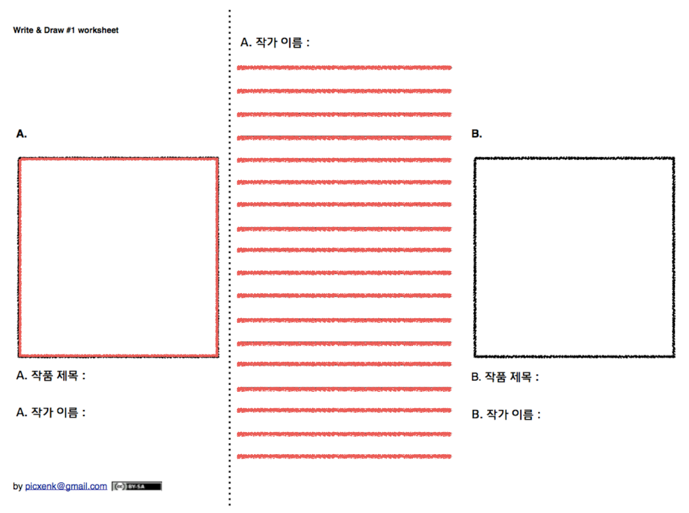

---
<!--
_header: ""
_footer: ""
-->
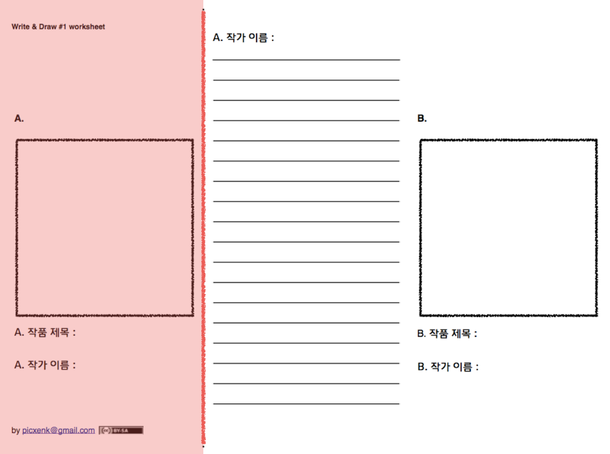

---
<!--
_header: ""
_footer: ""
-->
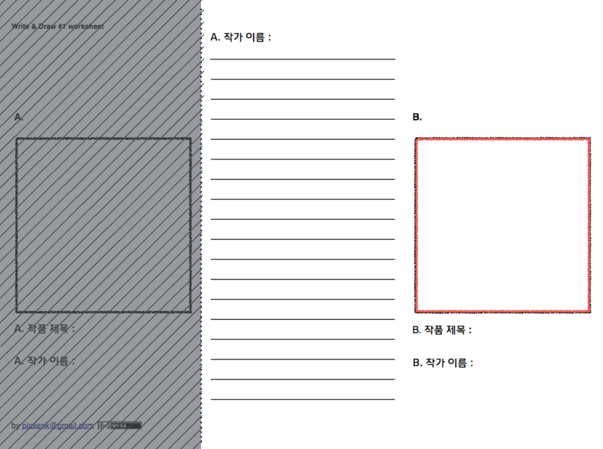

---
## [회고] 쓰고 그리기 01

* 회고 작성 [링크](https://docs.google.com/forms/d/e/1FAIpQLSdHOMRhtQqO858jDhdlrRLZw2N7p3rAgXq2ZkZg3_o640JkiQ/viewform?usp=sf_link)

* 과정
  - 어떤 느낌이었나요? 무엇을 알게 되었나요?
  - 어떤 점이 어려웠나요? 왜 그렇게 생각하나요?
  - (자유질문) 말하고 그리기와 어떤 차이를 경험했나요?

---
## [회고] 살펴보기

* 회고 살펴보기 [링크](https://docs.google.com/spreadsheets/d/1YStkNindL8PavEO8b5ch3H7gdel3vzdr-9RXkrwESPM/edit?usp=sharing)

---
## 비슷하면서 다른 활동

[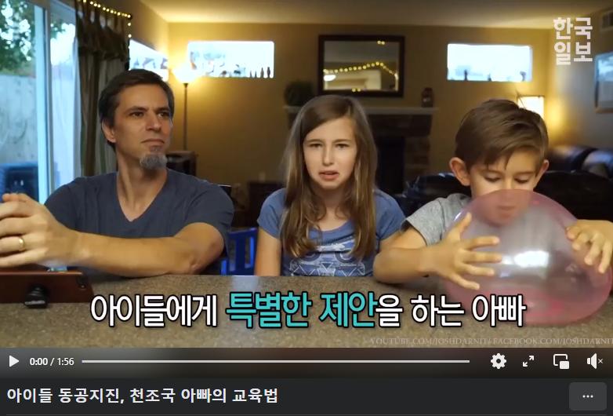](https://www.facebook.com/watch/?v=1409971409055633)

우리가 한 쓰고 그리기 활동과 비슷한가? 다른가? 어떤 느낌이 드나요?

---
## [활동] 쓰고 그리기 02

* 제약의 추가
  - 그리드(가로 세로 선)를 추가합니다.
  - 그리드는 점, 선, 면을 이용할 수 있습니다.

---
<!--
_header: ""
_footer: ""
-->
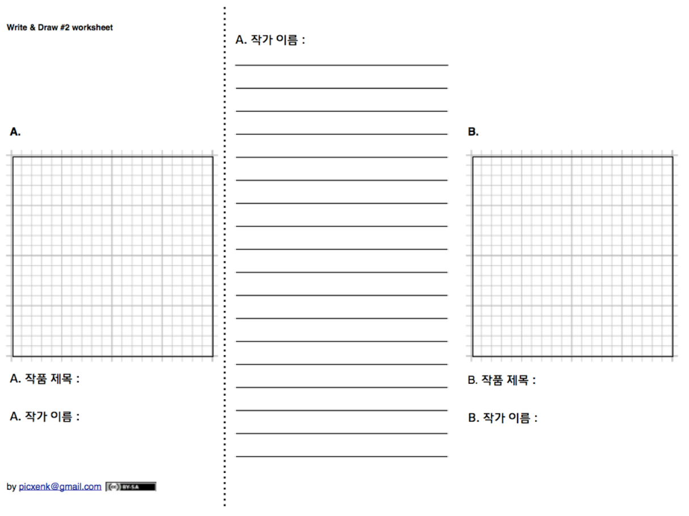

---
## 결과물 모아보기

* 비슷하게 그린 경우
  - 완전 똑같이 그린 경우
  - 비슷하지만 크기나 비율 또는 방향이 달라진 경우

* 엉뚱한 결과물(전혀 다른 경우)이 나온 경우
  - 문화적 맥락의 차이
  - 표현의 차이

---
## [회고] 쓰고 그리기 02

* 회고 작성 [링크](https://docs.google.com/forms/d/e/1FAIpQLSdHOMRhtQqO858jDhdlrRLZw2N7p3rAgXq2ZkZg3_o640JkiQ/viewform?usp=sf_link)

* 과정
  - 어떤 느낌이었나요? 무엇을 알게 되었나요?
  - 어떤 점이 어려웠나요? 왜 그렇게 생각하나요?
  - (자유질문) 쓰고 그리기 01 활동과 어떤 차이를 경험했나요?

---
## [회고] 살펴보기

* 회고 살펴보기 [링크](https://docs.google.com/spreadsheets/d/1YStkNindL8PavEO8b5ch3H7gdel3vzdr-9RXkrwESPM/edit?usp=sharing)

---
# 다른 관점의 생각
<!--
_class: lead
-->

---
<!--
_header: ""
_footer: ""
-->

<!--
https://twitter.com/yokoono/status/1354127033433993218
-->

구름 조각

구름이 뚝뚝 떨어지는 것을 상상해 보세요.
그리고 정원에 구멍을 파서 넣어보세요.

오노 요코, Ono Yoko

* [John Lennon, Imagine](https://www.youtube.com/watch?v=YkgkThdzX-8)
---
<!--
_header: ""
_footer: ""
-->
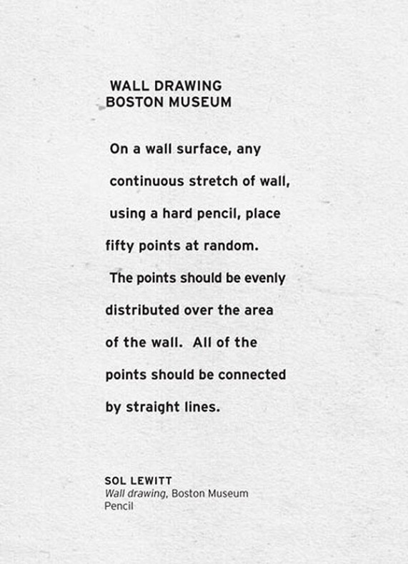
<!--
https://www.richardlapham.com/itp/2017/11/14/sol-lewitt-generator
-->

벽 드로잉 
보스톤 미술관

어떤 쭉 펼쳐진 벽 표면 위에, 연필을 사용해서, 50개의 임의의 점을 찍습니다.
점들은 벽 표면에 골고루 분포되어야 합니다.
모든 점들은 직선으로 서로 연결되어야 합니다.

솔 르윗
벽 드로잉, 보스톤 미술관 연필

---
<!--
_header: ""
_footer: ""
-->

[SMFA Exhibitions | Sol LeWitt Drawing #118](https://www.youtube.com/watch?v=ky9K_-NJoPU)

---
# Code 에 대해 생각하기
<!--
_class: lead
-->

---
## 코드: Code

* Communication: 소통, 대화
* Clarification: 설명, 해명
* Obfuscation: 혼란시키는 일

---
## 코드: [Code](https://www.merriam-webster.com/dictionary/code)

1. a systematic statement of a body of law
2. a system of symbols (such as letters or numbers) used to represent assigned and often secret meanings
3. instructions for a computer (as within a piece of software)

---
## 형식 언어/시스템: Formal Language/System

* 구조, 범위 따위가 명확하게 규정되고 정의된 인공 언어
* 주로 어휘, 논리, 프로그래밍에서 어법을 형식화하여 기술한 것

---
<!--
_header: ""
_footer: ""
-->
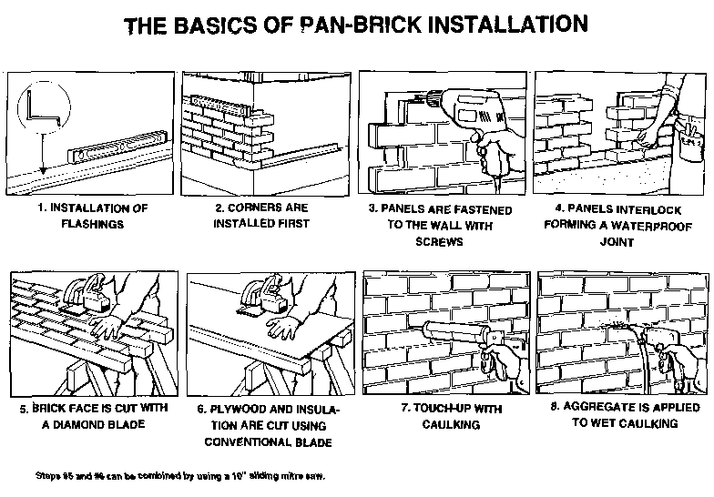
<!--
http://www.panbrick.ca/images/GenIns.gif
-->

---
<!--
_header: ""
_footer: ""
-->
[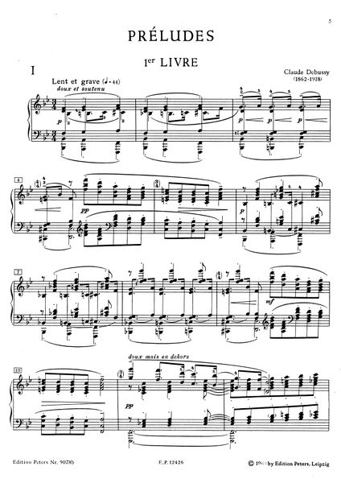](https://vmirror.imslp.org/files/imglnks/usimg/7/71/IMSLP434162-PMLP02394-debussy_12preludes_jumppanen.mp3)

---
<!--
_header: ""
_footer: ""
-->
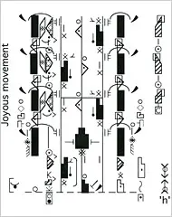
<!--
labanotation
https://www.nytimes.com/2007/08/30/arts/dance/30nota.html
-->

---
<!--
_header: ""
_footer: ""
-->
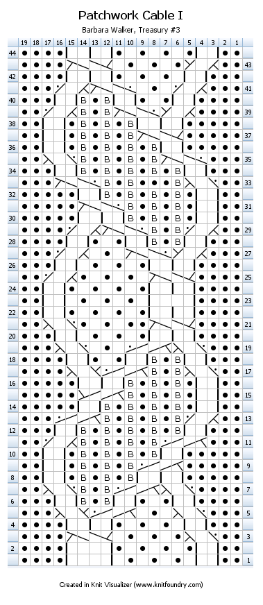
<!--
knit visualizer
https://knitfoundry.com/knitvisualizer.html
-->

---
<!--
_header: ""
_footer: ""
-->
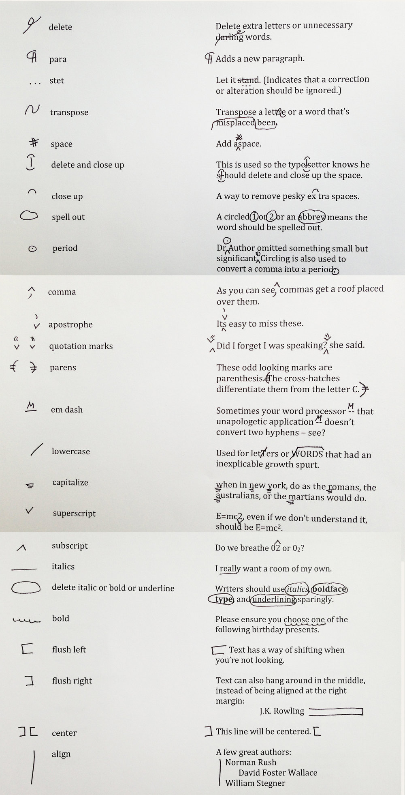
<!--
Correction signs in writing
https://nybookeditors.com/2013/06/copyediting-marks/
-->

---
# 앞으로 만나게 될 코드 Code

* 컴퓨터에게 내 생각이나 의도를 전달하기 위한 소통의 도구
* 우리가 사용하는 자연어와 비슷한 점과 다른 점이 있다. 
* 코드는 대표적인 '형식언어' 이다.
* 코드는 어떤 점은 편하게 느껴지고, 어떤 점은 불편하게 느껴진다.
* 하지만, 결코 한 가지 방식만 있다고 생각하지 말자!
* 코드를 배우는 것은, "새로운 관점의 생각하고 표현하는 법"을 배우는 것이다.

---
<!--
_class: lead
-->

By relieving the brain of all unnecessary work,
a good **notation** sets it free to concentrate on more advanced problems

A. Whitehead, An Introduction to Mathematics

---
# Thanks! 🎉 
<!--
_class: lead
_paginate: false
-->
수업 관련하여 궁금한 사항은 
이메일, 수톡, 이클래스 쪽지 등으로 연락주세요.