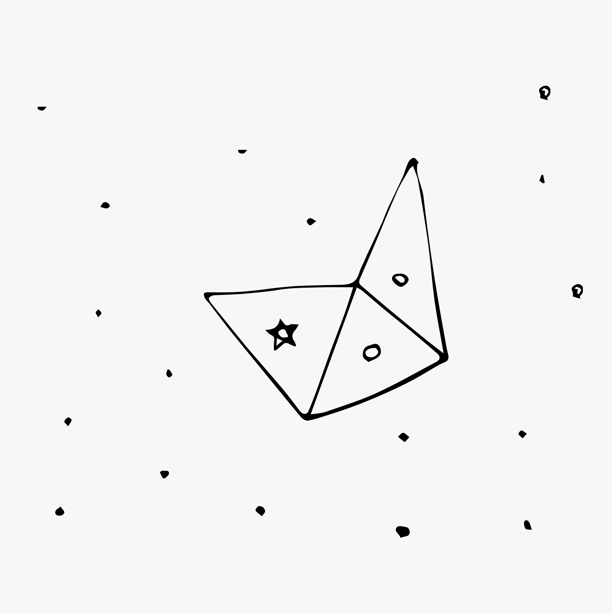
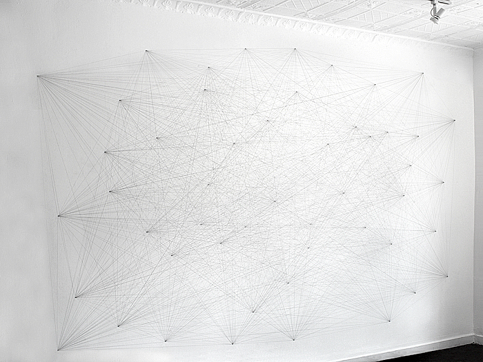
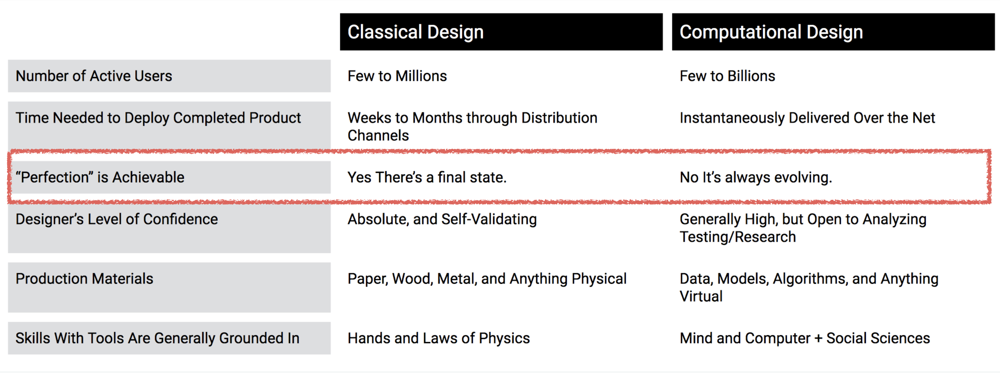
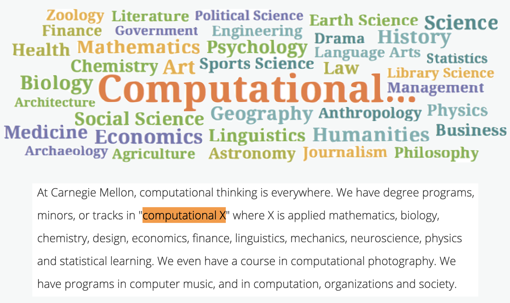

<!--
_class: lead
_paginate: false
-->
# **창의 컴퓨팅 입문**
###### Week 03 : Conditional Design

---
## 목차

* 지난 시간 리뷰
* 낙서 속 규칙
* 규칙성 경험하기
* 규칙 만들기
* 규칙의 의미

---
## 지난 시간 리뷰

* 말하고 그리기
* 쓰고 그리기 &rarr; 그리드 제약
* 다른 관점의 생각 &rarr; 과정과 결과
* Code 에 대해 생각하기 &rarr; 형식언어

---

### 낙서 속 규칙
- 한 사람씩 돌아가며 두 점을 직선으로 연결합니다.
- 이 때, 직선은 서로 포개어지거나 다른 직선을 가로지를 수 없습니다. 
- 점을 연결한 선이 삼각형 모양을 이룰 때, 마지막으로 선을 그었던 사람이 자신의 심볼을 삼각형의 가운데에 그려 넣습니다.
- 삼각형의 모양은 어떠한 모양(이등변, 부등변)이어도 관계 없습니다. 
- 삼각형 안에는 점이 들어 갈 수 없습니다.

---
## 낙서 속 규칙

* 규칙을 정리해 봅시다.
  - 사전 준비
  - 각 참여자가 가장 처음으로 할 일
  - 각자가 돌아가며 반복적으로 할 일

---
## 낙서 속 규칙

* 사전준비
  1. 종이와 펜을 준비합니다.
  2. 2~3명의 사람이 한 팀이 됩니다.

* 각 참여자가 가장 처음으로 할 일
  1. 빈 종이에 무작위로 점을 고르게 찍어줍니다.
  2. 각자 자신이 원하는 심볼(원, 세모, 네모 등)을 정합니다.

---

## 낙서 속 규칙

* 각자가 돌아가며 진행할 일
  1. 선 그리기
    - 한 사람씩 돌아가며 두 점을 직선으로 연결합니다.
    - 직선은 서로 포개어지거나 다른 직선을 가로지를 수 없습니다.
  2. 삼각형 그리기
    - 점을 연결한 선이 삼각형 모양을 이루면, 자신의 심볼을 삼각형의 가운데에 표시합니다. 
    - 삼각형의 모양은 어떠한 모양(이등변, 부등변)이어도 관계 없습니다.
    - 삼각형 안에는 점이 들어 갈 수 없습니다.

---
<!--
_class: lead
-->

# 규칙성 경험하기

---

## [활동] 낙서놀이 1 (We were hatching)

* 각자가 돌아가며 다음을 진행합니다.
  - 직선을 긋기
    1. 두 점을 잇는 직선을 그어주세요.
    2. 될 수 있으면 기존의 선에 연결되는 선을 그어주세요.
    3. 선을 그릴 때, 기존 선과의 각도를 다음과 같이 지켜봅시다.
      - 검은선 : 0 ~ 45도, 파란선 : 45 ~ 90도, 빨간선 : 90 ~ 135도, 녹색선 : 135 ~ 180도
    4. 도형이 완성되면 자신의 펜으로 마지막 선에 평행선을 그려서 도형을 채웁니다.
  - 점 하나를 추가로 찍기
    1. 기존 점에서 10cm 이내로 떨어진 점을 찍습니다. 2) 기존 점이 만드는 공간의 외부에 새 점을 찍습니다.

---
<!--
_header: ""
_footer: ""
-->

[we were hatching](https://www.conditionaldesign.org/workshops/hatching/)

---

## [활동] 낙서놀이 2 (We knotted)

* 사전 준비
  1. 큰 종이와 4가지 색의 펜을 준비합니다.
  2. 4명이 플레이 합니다.
  3. 참여자들은 각각 다른 색의 펜을 선택합니다.
  4. 가장 먼저 시작할 사람을 정합니다. 시계방향으로 돌아가며 진행합니다.

* 각 참여자가 맨 처음에 할 일
  1. 첫 번째 선은 종이의 가운데에 적당한 길이의 선을 그립니다.
  2. 두 번째 선 부터는 다른 색의 선을 한 번은 위로 한 번은 아래로 지나가도 록 그립니다.
  3. 위로 지나가는 선은 겹처서 그리고, 아래로 지나가는 선은 끊어서 그립니다.

---
## [활동] 낙서놀이 2 (We knotted)

* 각자가 돌아가며 다음을 진행합니다.
  - 선 그리기
    1. 자신의 선에서 한 쪽을 이어서 선을 그립니다. 선은 반드시 다른 색의 선 을 한번은 위로 한 번은 아래로 지나가야 합니다.
    2. 선의 한쪽을 이어서 그릴 때 더 이상 다른 색의 선을 위, 아래로 지나갈 수 없다면 그 쪽은 죽은 것입니다.
    3. 양 쪽 모두 더 이상 선을 이어서 그릴 수 없다면, 종이의 다른 공간에 새로 운 선을 그립니다.

---
<!--
_header: ""
_footer: ""
-->

[we knotted](https://www.conditionaldesign.org/workshops/knots/)

---
<!--
_header: ""
_footer: ""
-->

[SMFA Exhibitions | Sol LeWitt Drawing #118](https://www.youtube.com/watch?v=ky9K_-NJoPU)

---
## [회고] 낙서놀이

* 회고 작성 [링크](https://docs.google.com/forms/d/e/1FAIpQLSf_C1S-UB_7k9wGOl-pksK86T9tkx2wIdM80rKlQJ4s5Cm5YQ/viewform?usp=sf_link)

* 과정
  - 어떤 느낌이었나요? 재밌거나 어려운 점이 있었나요?
  - 무엇을 알게 되었나요? 어떤 점이 새로웠죠?
  - (자유질문) 솔 르윗의 벽드로잉과 낙서놀이를 비교하면 어떤 생각 이 드나요?

---
<!--
_class: lead
-->

# 규칙 만들기

---
## 조건부 디자인 Conditional Design

Conditional Design은 디자인 전략으로서 참가자 간의 협력을 자 극하고 예측할 수없는 결과를 가져 오는 장난스럽게 디자인 된 **일련의 규칙과 조건**들을 말합니다.

[Conditional Design
A manifesto for artists and designers.](https://conditionaldesign.org/manifesto/)

---
<!--
_header: ""
_footer: ""
-->

[we folded paper](https://conditionaldesign.org/workshops/fluxfold/)

---
<!--
_header: ""
_footer: ""
-->

[we encircled circles](https://conditionaldesign.org/workshops/encircling/)

---
<!--
_header: ""
_footer: ""
-->

[we intersected cells](https://conditionaldesign.org/workshops/cellular-relationships/)

---
## 규칙의 형식

* **준비** 사항과 초기 설정
* **반복** 할 기본적인 규칙과 설명 
* **예외 및 변칙**에 대한 처리

---
## [활동] 규칙 만들기

* 이번에는 여러분이 만들어 봅시다.
* 3명씩(혹은 4명) 짝을 지어주세요.
* 연습장에 연습하고 만들어진 규칙은 A5에 크고 또렷하게 적어주세요. 
* 규칙의 이름을 멋지게 지어주세요.
* 참여한 사람들의 이름도 적어주세요.

---
## [활동] 다른 팀이 만든 규칙 경험해보기

* 규칙을 서로 바꾸어 해봅시다.
* 만약 문제가 발생했다면 어떤 점이 문제였는지 적어두었다가
그 규칙을 만든 팀에게 전달합니다
* 우리의 목표는 최대한 규칙 범위 안에서 예쁜 작품을 만드는 것!

---
## [회고] 규칙 만들기

* 회고 작성 [링크](https://docs.google.com/forms/d/e/1FAIpQLSf_C1S-UB_7k9wGOl-pksK86T9tkx2wIdM80rKlQJ4s5Cm5YQ/viewform?usp=sf_link)

* 과정
  - 어떤 느낌이었나요? 재밌거나 어려운 점이 있었나요?
  - 무엇을 알게 되었나요? 어떤 점이 새로웠죠?
  - (자유질문) Conditional Design은 그동안 여러분이 경험한 창작 작업과 비교해보면 어떤 차이가 있나요?

---
<!--
_class: lead
-->

# 규칙의 의미

---
<!--
_header: ""
_footer: ""
-->

[SMFA Exhibitions | Sol LeWitt Drawing #118](https://www.youtube.com/watch?v=ky9K_-NJoPU)

---
# 우리가 방금 경험한 활동의 특징?

* 결과물의 측면
* 과정의 측면
* 우리가 평소에 주변에서 경험하는 것?

---
# Computational 의 의미

알고리즘 / 자동화 <-> 수작업
컴퓨테이션에 의한  <-> 컴퓨터를 활용한
결과를 정확히 예측할 수 없는 <-> 결과를 정확히 예측한
과정을 정의한 <-> 결과물을 정의한

---
<!--
_header: ""
_footer: ""
-->

[John Maeda | Design in Tech Report](https://designintech.report/)

---
<!--
_header: ""
_footer: ""
-->

["At Carnegie Mellon, computational thinking is everywhere"](https://www.cs.cmu.edu/link/research-notebook-computational-thinking-what-and-why)

---
<!--
_class: lead
-->

“If you want to survive in Design, 
you better learn to Code”

John Maeda

---
<!--
_class: lead
_paginate: false
-->
# Thanks! 🎉 

수업 관련하여 궁금한 사항은 
이메일, 수톡, 이클래스 쪽지 등으로 연락주세요.