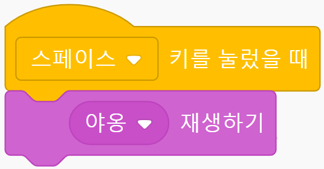
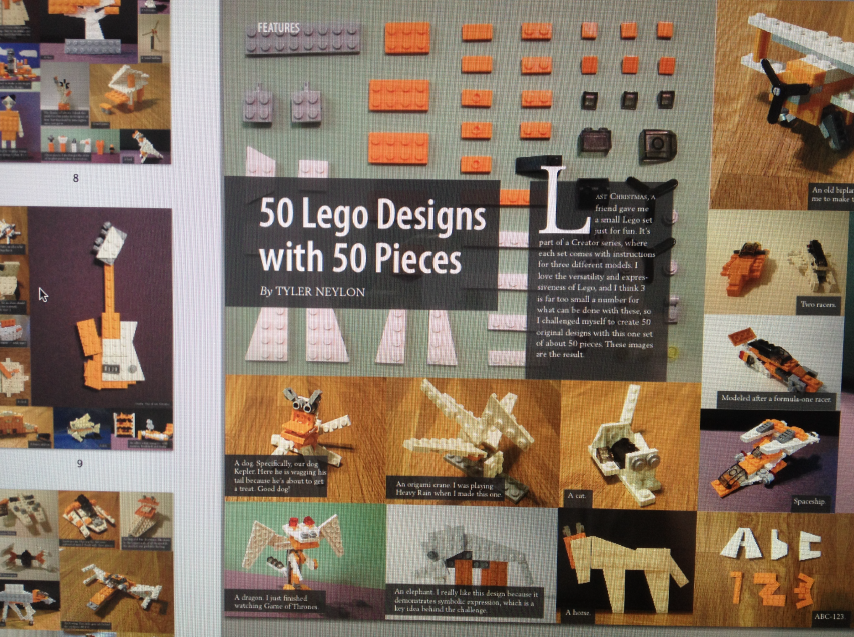
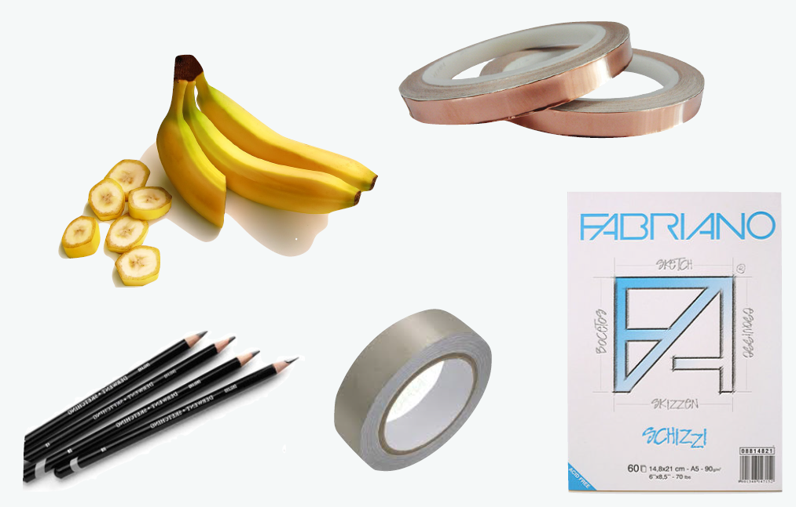

<!--
_class: lead
_paginate: false
-->
# **창의 컴퓨팅 입문**
###### Week 05 : Start Makey Makey

---
## 목차

* 지난 시간 리뷰
* 첫 만남
* 꼼지락꼼지락
* 사부작사부작

---
## 지난 시간 리뷰

* 관찰 랠리
* 만지작, 만지작 : 10개의 블록, 10개의 실험
* 뚝딱, 뚝딱 : 나의 관심과 연결하여 표현

---
<!--
_class: lead
_paginate: false
-->
# 첫 만남

---

## 준비하기

* 팀 구성 : 2명이 1팀 (드라이버 + 네비게이터)
* 준비물 : 팀 당 PC 1대, 메이키메이키 1세트

---
## 관찰하기

* 팀 별로 메이키메이키 관찰하기
  - 메이키메이키를 보고, 보이는 대로 말해보기
  - 생김새, 구성요소 등 눈에 보이는 것 모두 살펴보기
  - 어떤 기능을 할 지도 상상해 보기
* 다 함께 이야기 해보기

---

## 실험하기

* 어떻게 사용하는 걸까?
* 컴퓨터에 메이키메이키를 연결하고, 웹브라우저를 실행해보자.

---
<!--
_header: ""
_footer: ""
-->

---
<!--
_class: lead
_paginate: false
-->
# 꼼지락꼼지락

몸을 계속 천천히 좀스럽게 움직이는 모양(표준국어대사전)

---

## [활동] 실험하기 - 고양이-집사 놀이

* 고양이와 집사를 정해주세요.
* 스크래치에서 다음 코드를 작성해 보세요.
* 고양이는 메이키메이키의 earth 부분을 손으로 잡고,
* 집사는 메이키메이키의 space 부분을 손으로 잡아봅시다.
* 그리고, 집사가 귀여운? 고양이를 쓰다듬어 줍시다.

---
## [활동] 실험하기 - 6가지 장난

* 여러분, 스크래치 잊지 않았죠? https://scratch.mit.edu/
* 스크래치와 메이키메이키를 함께 사용하여,
6가지 장난들을 만들어 보세요.
* “잊지말고, 손을 적당히 촉촉하게 해주세요.”
* 네비게이터 / 드라이버의 역할을 바꿔가며 해보세요.

---
<!--
_header: ""
_footer: ""
-->

---
## [활동] 실험하기 - 장난 x 장난

* 다른 팀의 장난을 살펴봅시다. (지난 스크래치 관찰 랠리처럼)
  - 네비게이터는 자리에서 일어나 다른 팀으로 이동하여 다른 팀이 시도한 장난에 대해 듣습니다.
  - 그리고 이어서 자신의 팀으로 돌아와 팀원에게 알려줍니다.
* 기존의 장난에 새로운 장난을 더 해봅시다.
  - 예상하지 못한 결과의 장난을 만들어 봅시다.

---
<!--
_header: ""
_footer: ""
-->

[MaKey MaKey - An Invention Kit for Everyone](https://www.youtube.com/watch?v=rfQqh7iCcOU&feature=youtu.be)

---
<!--
_header: ""
_footer: ""
-->

[MaKey MaKey - An Invention Kit for Everyone](https://www.youtube.com/watch?v=VCNCQ4cV5LM)

---
<!--
_class: lead
_paginate: false
-->
# 사부작사부작
별로 힘들이지 않고 계속 가볍게 행동하는 모양(표준국어대사전)

---
<!--
_class: lead
_paginate: false
-->
# "Hello World"
모든 (프로그래밍) 배움의 시작이 여기서 부터 라고 해도 과언이 아닌...

---
## [활동] Makey Makey x Scratch

* 준비 : 4인 1팀, 2대의 PC
* 작품 주제 : “첫 만남”
  - 스크래치와 메이키메이키를 이용하여 “첫 만남”을 주제로 상호작용이 일어나는 작품을 만들어보세요.
  - “첫 만남” 속에서 일어나는 접촉, 행동, 상호작용, 느낌, 감정, 소리, 찰나 등등 모든 것이 가능합니다.
  - “첫 만남”에서 촉발되는 다른 소재의 이야기나 경험도 가능하니 다양한 관점으로 재밌게 접근해주세요.

---
<!--
_header: ""
_footer: ""
-->

---
## [활동] Makey Makey x Scratch

* 프로젝트 문서 작성하기
  - 작품을 잘 소개할 수 있는 제목을 지어주세요.
  - 작품을 소개하는 글을 간단하게 작성해 주세요.
  - 작품 제작 과정을 보여주는 사진과 코드 사진을 찍어주세요.
* 개인 회고 작성하기

---
## 작품 아이디어를 만드는 방법

1. 아이디어 던지기
1.1 떠오르는 생각을 그대로 말하기 또는 낙서하기
1.2 엉뚱하게 상상하기, 다른 사람의 아이디어에 이어 말하기
1.3 이 과정에서 서로 비난하지 않기!

2. 아이디어 줍기
2.1 재미있어 보이는 것, 우리가 할 수 있는 것을 고르기
2.2 서로의 의견을 모아서 정하기
2.3 우리가 탐험한 기능 내에서 구현하기!

---
<!--
_class: lead
_paginate: false
-->
# Thanks! 🎉 

수업 관련하여 궁금한 사항은 
이메일, 수톡, 이클래스 쪽지 등으로 연락주세요.