<!--
_class: lead
_paginate: false
-->
# **창의 컴퓨팅 입문**
###### Week 06 : Generative Drawing (online)

---
## 목차

* 지난 시간 리뷰
* 오픈소스 하드웨어의 유전자
* 워밍업 퀴즈
* 구조의 발견
* 변주
* 제너러티브 드로잉 작품 만들기

---
## 오늘 수업 진행 방법

* 오늘은 **혼자서** 진행하는 온라인 수업입니다.
* 슬라이드의 **[활동]** 표시가 나오면 영상/슬라이드를 멈추고 직접 해보세요.
* 정답을 알려주기보다, **활동의 규칙**만 드릴게요.
* 막히면 되돌아가서 다시 시도하세요.
* 준비물 : PC 1대, 웹 브라우저, 메모할 도구(노트, 휴대폰 카메라)

---

## 지난 시간 리뷰

* 첫 만남 &rarr; [메이키메이키](https://makeymakey.com/)
* 꼼지락꼼지락 
* 사부작사부작 &rarr; [프로젝트 둘러보기](https://docs.google.com/presentation/d/1urbYhrhhQnYqIhhdWTlcoiSZjBm6plhCaDBm_SG4AYg/edit?usp=sharing)

---
<!--
_class: lead
_paginate: false
-->
# 오픈소스 하드웨어의 유전자

---
<!--
_header: ""
_footer: ""
-->

---
<!--
_header: ""
_footer: ""
-->
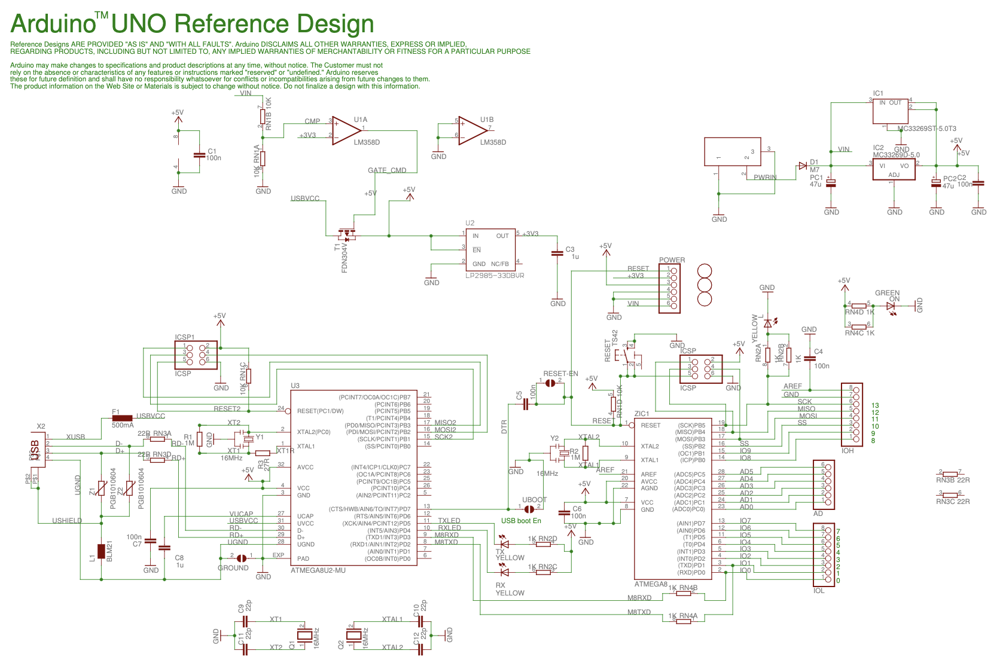

---
<!--
_header: ""
_footer: ""
-->

---
<!--
_header: ""
_footer: ""
-->
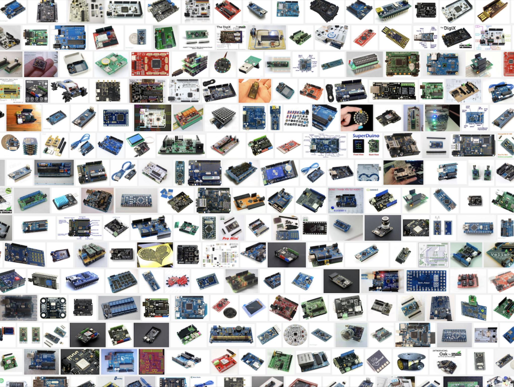

---
<!--
_header: ""
_footer: ""
-->

---
<!--
_header: ""
_footer: ""
-->

## [오픈소스 하드웨어](https://ko.wikipedia.org/wiki/%EC%98%A4%ED%94%88_%EC%86%8C%EC%8A%A4_%ED%95%98%EB%93%9C%EC%9B%A8%EC%96%B4)

오픈 소스 하드웨어 (OSHW)의 원칙 1.0

"오픈 소스 하드웨어는 누구나 이 디자인이나 이 디자인에 근거한 하드웨어를 배우고, 수정하고, 배포하고, 제조하고 팔 수 있는 그 디자인이 공개된 하드웨어이다." - [OSHA](https://www.oshwa.org/definition/korean/)

---
## [활동] 생각해보기

* 내 주변에 "설계도가 공개되어 있어서 누구나 고쳐 쓰고 다시 만들 수 있는" 물건이 있다면 어떤 것일까요?
* 디자인을 공개하면 좋은 점과 걱정되는 점을 각각 한 가지씩 생각해 보세요.

---
## 오늘의 놀이는, 
약간 머리를 쓰는 과정에서 시작하겠습니다. (Hard Fun) 
‘컴퓨팅’이 가진 어떤 구조를 느끼는게 목표입니다.

---
<!--
_class: lead
_paginate: false
-->
# 워밍업 퀴즈

---
## 준비하기
* 준비물 : PC 1대
* 웹 브라우저에서 스크래치 실행하기
  - https://scratch.mit.edu/

---
## [활동] 스크래치로 정사각형을 그려봅시다.
* 스크래치 무대에서, 
* 자유롭게 정사각형을 그려봅시다.

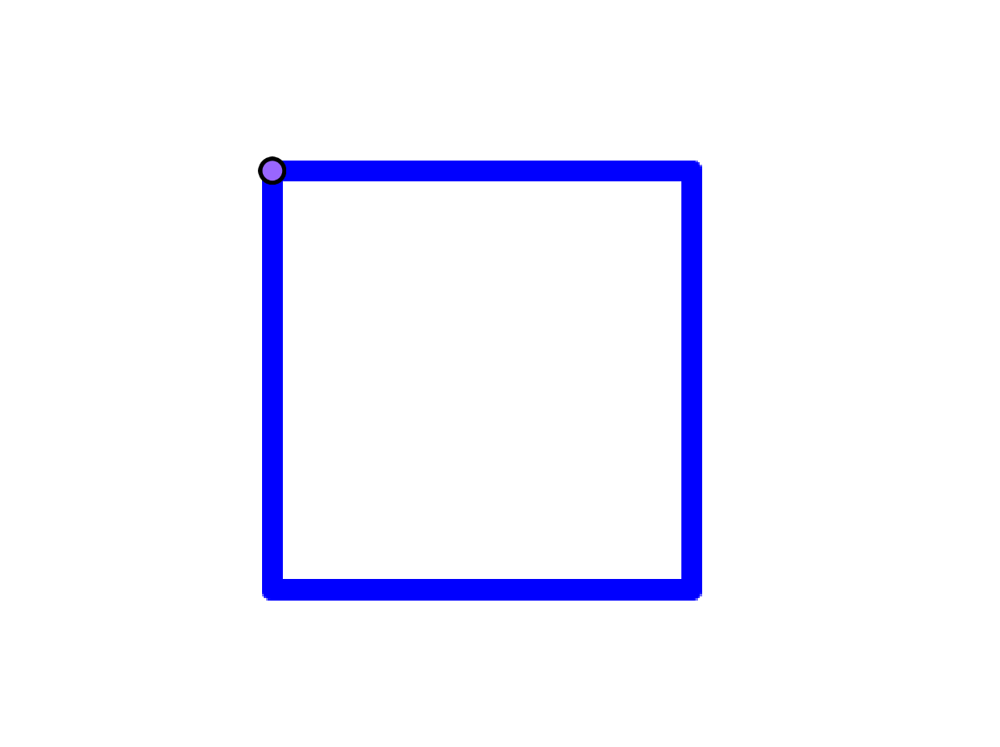

---
## [활동] 몇 가지 방법이 더 있나요? 더 찾아볼까요?
* 서로 다른 방법을 **최소 3가지** 찾아서 실험해 봅시다. 
* 힌트 : 블록을 줄이거나, 순서를 바꾸거나, 다른 블록으로 바꿔 보세요.

---
## [활동] 다음 블록을 사용해서 다시 그려봅시다.
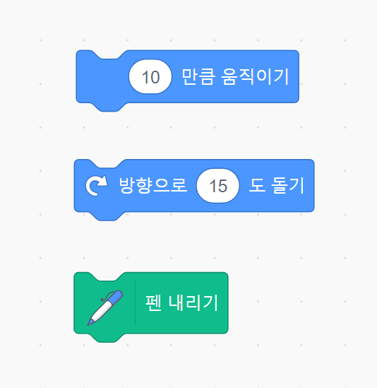

---
## [활동] 다음 블록을 사용해서 또 다시 그려봅시다.
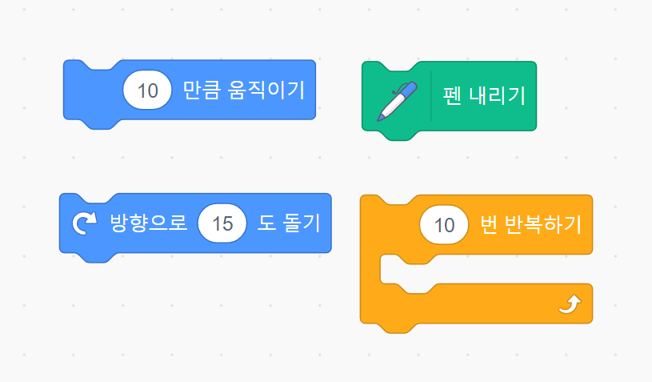

---
## 스스로 점검하기

* 같은 정사각형인데도 코드가 여러 가지일 수 있었나요?
* 어떤 코드가 가장 **짧고**, 어떤 코드가 가장 **이해하기 쉬웠나요**?
* 여러 번 반복되는 부분을 발견했나요?

---
<!--
_class: lead
_paginate: false
-->
# 구조의 발견

---
## 다음의 기본 구조에서 시작합시다.
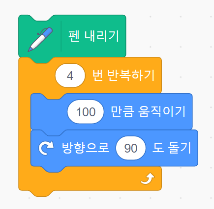

---
<!--
_header: ""
_footer: ""
-->
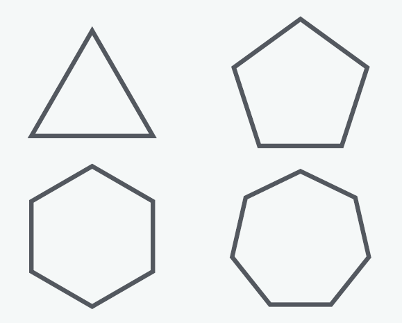

---
<!--
_header: ""
_footer: ""
-->
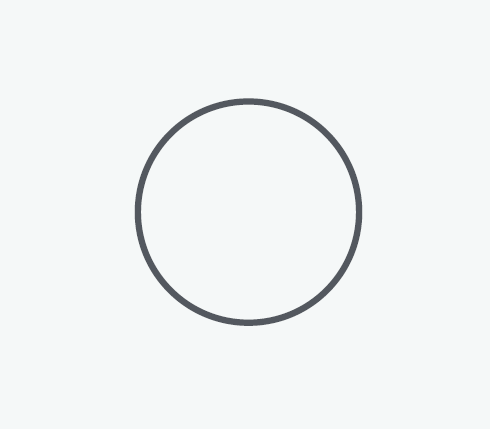

---
## [활동] x, y의 패턴을 찾아봅시다.
* 반복 횟수를 x, 오른쪽 방향으로 회전 각도를 y 로 가정하고,
* 코드를 실행하며 x, y 값이 어떻게 달라지는지 관찰하세요.
* 어떤 패턴을 발견했나요?

---
## x, y는 변수 (variable)
* 변수는, 우리를 괴롭히기 위해 있는게 아니라,
* 무언가를 도와주기 위한 구조이다.
* 스크래치에서 변수를 어떻게 만들고 사용할까?

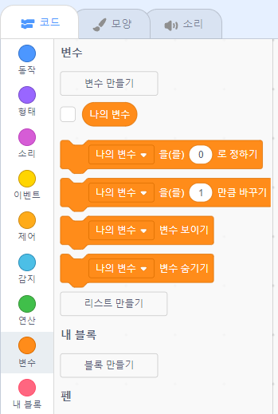

---
## 코드 묶음을 실행하는 방법
* 이벤트 블록을 사용한다.
* 메시지를 이용한다.
* 내 블록으로 정의한다.

---
### 이벤트 블록을 사용하기
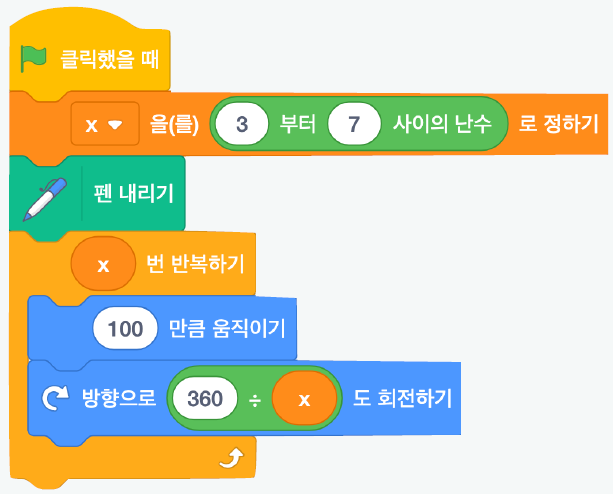

---
### 메시지 이용하기
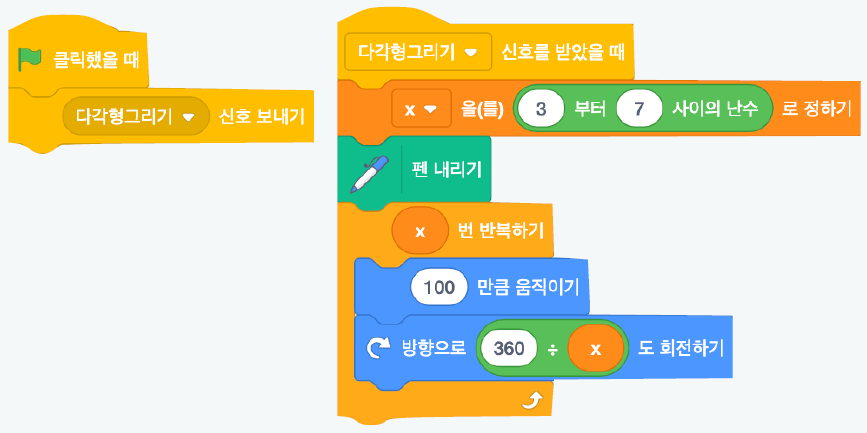

---
### 내 블록으로 정의
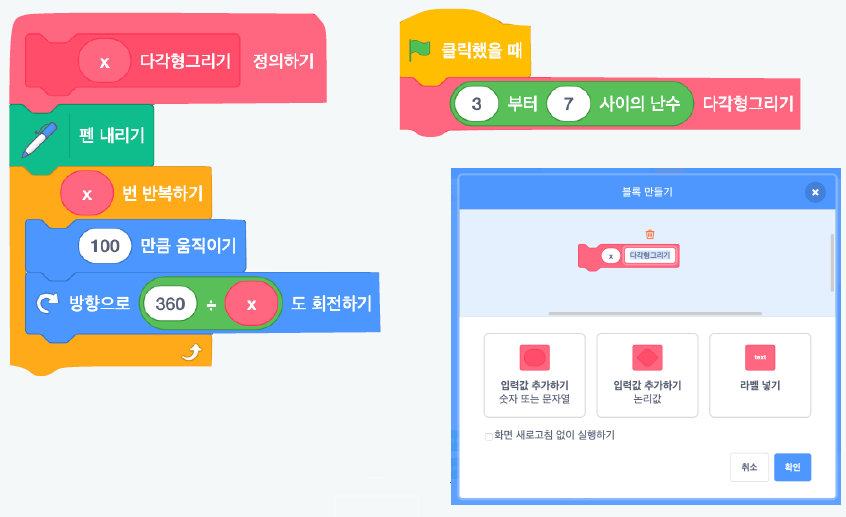

---
## [활동] 세 가지 방법 모두 해보기
* 앞에서 만든 정사각형 코드를 다음 세 가지 방법으로 각각 실행해 보세요.
  1. 이벤트 블록 (예: 스페이스 키를 눌렀을 때)
  2. 메시지 (예: 방송하기 / 메시지를 받았을 때)
  3. 내 블록으로 정의
* 어떤 방법이 가장 편하게 느껴졌나요? 

---
<!--
_class: lead
_paginate: false
-->
# 변주

---
## [활동] 실험하기
* 주제 : 스스로 변화를 만드는 코드 만들기
* 규칙 : 다음을 반복하기
  - 도형의 위치, 길이, 색상 등에 변화를 줄 수 있는 속성 한 가지 고르기
  - 속성을 변화시키기
    - 무작위한 변화 &rarr; 연산 > 난수
    - 일정한 변화 &rarr; 변수 > 바꾸기
* 약 20분 동안 최소 **5번**의 실험을 진행합니다.

---
<!--
_class: lead
_paginate: false
-->
# 제너러티브 드로잉
나만의 작품 만들기

---
## [활동] 제너러티브 드로잉
* 주제 : 스스로 변화를 만드는 그림 작품 만들기
* 규칙 
  - 앞에서 만든 다양한 실험 코드를 섞거나 응용하기
  - 한 가지 이상의 속성(색, 크기, 모양 등)이 변화(일정하게 또는 무작위하게) 될 수 있도록 고려하기
  - **컴퓨터 외부의 동작이 내부의 그림에 영향을 주도록 만들기**    
    - 키보드, 마우스, 마이크 소리, 웹캠 움직임 감지 
    (스크래치 &lsquo;비디오 감지&rsquo; 확장 기능) 등 활용

---
## [활동] 프로젝트 문서 작성하기
* 작품을 잘 소개할 수 있는 ‘근사한 제목’을 지어주세요.
* 작품을 소개하는 글을 간단하게 작성해 주세요.
* 작품 제작 과정을 보여주는 사진/화면 캡처 2~3장과 코드 사진을 첨부해 주세요.
* 모든 제작 활동이 끝나면, 개인회고도 작성해 주세요.  

---
<!--
_class: lead
_paginate: false
-->
# Thanks! 🎉 

수업 관련하여 궁금한 사항은 
이메일, LMS 질의응답 등으로 연락주세요.
