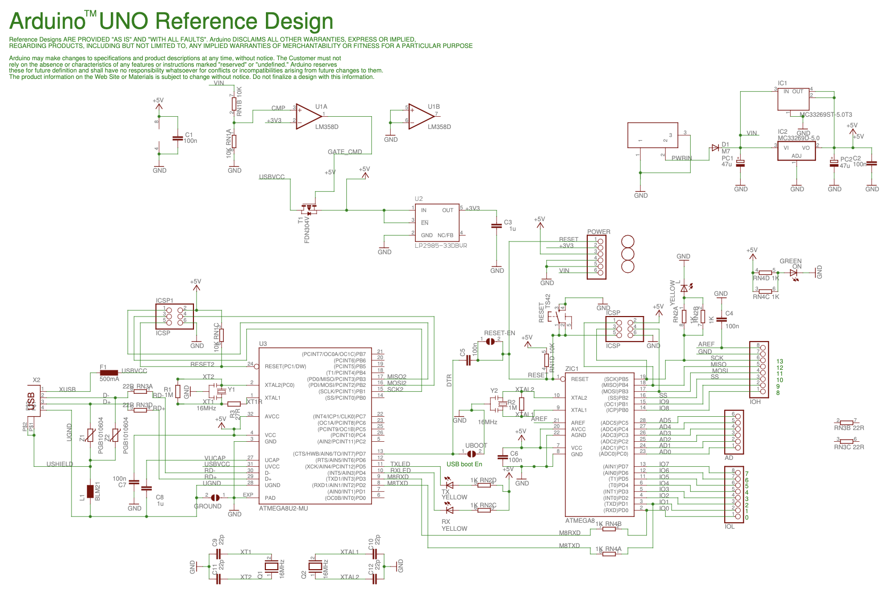

<!--
_class: lead
_paginate: false
-->
# **창의 컴퓨팅 입문**
###### Week 06 : Generative Drawing 

---
## 목차

* 지난 시간 리뷰
* 오픈소스 하드웨어의 유전자
* 워밍업 퀴즈
* 구조의 발견
* 변주

---

## 지난 시간 리뷰

* 첫 만남 &rarr; [메이키메이키](https://makeymakey.com/)
* 꼼지락꼼지락 
* 사부작사부작 &rarr; [프로젝트 둘러보기](https://docs.google.com/presentation/d/12aFfgo1cypIOi4QCRkT7DkYtAsk7UoDA7K7oHnEn6l4/edit?usp=sharing)

---
<!--
_class: lead
_paginate: false
-->
# 오픈소스 하드웨어의 유전자

---
<!--
_header: ""
_footer: ""
-->

---
<!--
_header: ""
_footer: ""
-->

---
<!--
_header: ""
_footer: ""
-->

---
<!--
_header: ""
_footer: ""
-->

---
<!--
_header: ""
_footer: ""
-->

---
<!--
_class: lead
_paginate: false
-->
# 워밍업 퀴즈

---
## 오늘의 놀이는, 
약간 머리를 쓰는 과정에서 시작하겠습니다. (Hard Fun) 
‘컴퓨팅’이 가진 어떤 구조를 느끼는게 목표입니다.

---
## 준비하기
* 팀 구성 : 2명이 1팀 (드라이버 + 네비게이터)
* 준비물 : 팀 당 PC 1대
* 크롬 웹 브라우저에서 스크래치 실행하기

---
## 스크래치로 정사각형을 그려봅시다.

---
## 몇 가지 방법이 더 있나요? 더 찾아볼까요?

---
## 다음 블록을 사용해서 다시 그려봅시다.

---
## 다음 블록을 사용해서 또 다시 그려봅시다.

---
<!--
_class: lead
_paginate: false
-->
# 구조의 발견

---
## 고양이를 잠시 잊읍시다.

---
## 다음의 기본 구조에서 시작합시다.

---
## 스크래치에서 다음 도형들을 그려봅시다.

---
## 혹시, 원을 그릴수도 있을까요?

---
## 패턴을 찾아봅시다. (이럴때 사용하는 것이 수학!)

---
## x, y는 변수 (variable)
* 변수는, 우리를 괴롭히기 위해 있는게 아니라,
* 무언가를 도와주기 위한 구조이다.
* 스크래치에서 변수를 어떻게 만들고 사용할까?

---
## 코드 묶음을 실행하는 방법
* 이벤트 블록을 사용한다.
* 메시지를 이용한다.
* 나만의 블록으로 정의한다.

---

---
<!--
_class: lead
_paginate: false
-->
# 변주

---
<!--
_class: lead
_paginate: false
-->
# Thanks! 🎉 

수업 관련하여 궁금한 사항은 
이메일, 수톡, 이클래스 쪽지 등으로 연락주세요.