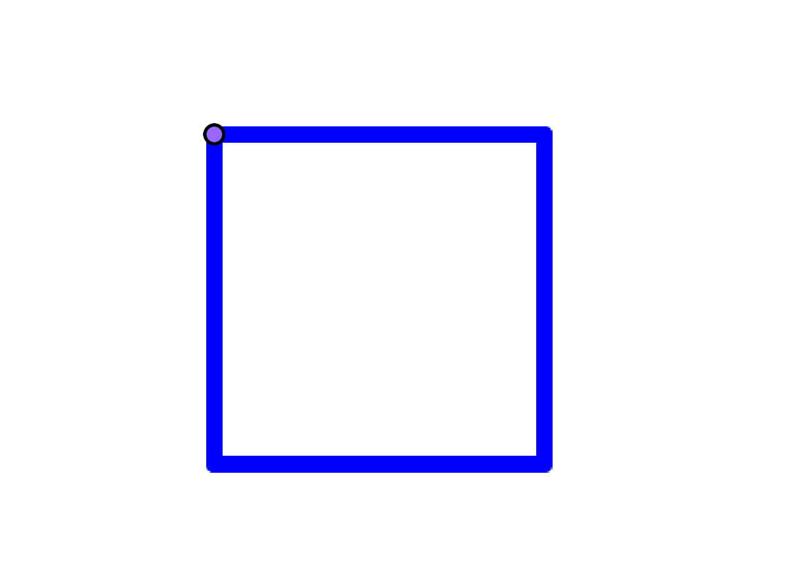
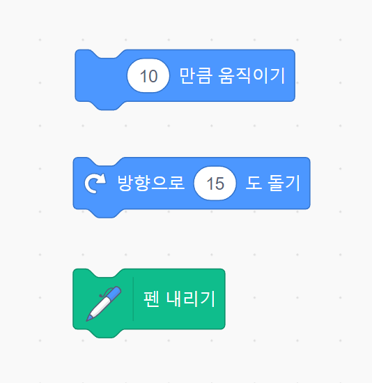
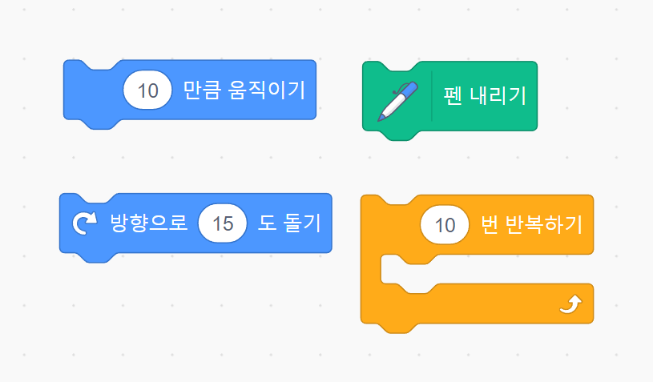
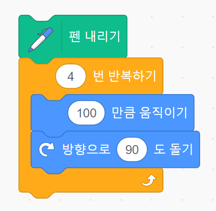
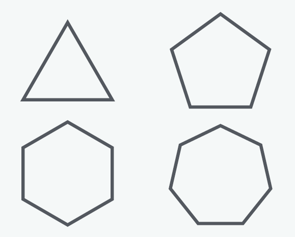
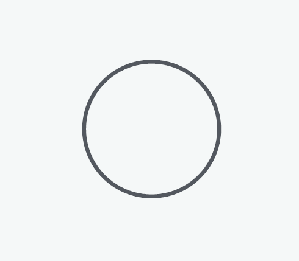
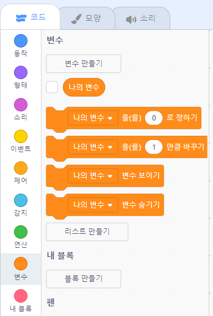
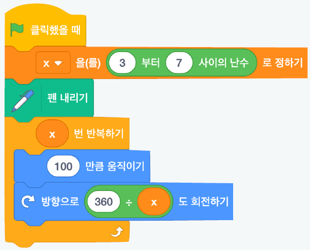
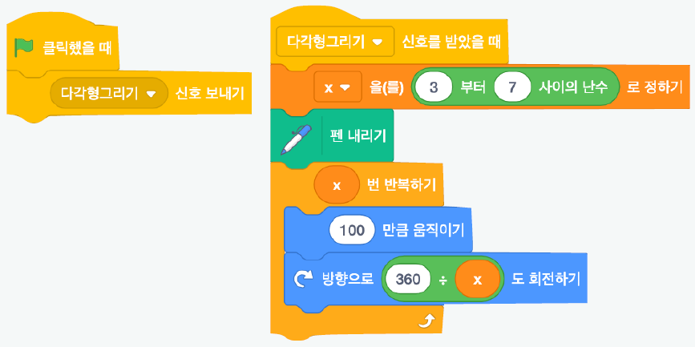
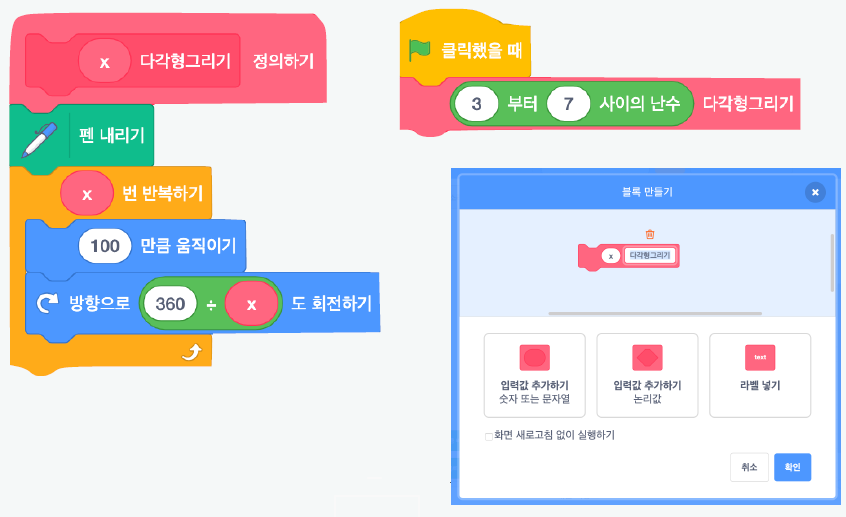

<!--
_class: lead
_paginate: false
-->
# **창의 컴퓨팅 입문**
###### Week 06 : Generative Drawing 

---
## 목차

* 지난 시간 리뷰
* 오픈소스 하드웨어의 유전자
* 워밍업 퀴즈
* 구조의 발견
* 변주

---

## 지난 시간 리뷰

* 첫 만남 &rarr; [메이키메이키](https://makeymakey.com/)
* 꼼지락꼼지락 
* 사부작사부작 &rarr; [프로젝트 둘러보기](https://docs.google.com/presentation/d/12aFfgo1cypIOi4QCRkT7DkYtAsk7UoDA7K7oHnEn6l4/edit?usp=sharing)

---
<!--
_class: lead
_paginate: false
-->
# 오픈소스 하드웨어의 유전자

---
<!--
_header: ""
_footer: ""
-->

---
<!--
_header: ""
_footer: ""
-->

---
<!--
_header: ""
_footer: ""
-->

---
<!--
_header: ""
_footer: ""
-->

---
<!--
_header: ""
_footer: ""
-->

---
<!--
_header: ""
_footer: ""
-->

## [오픈소스 하드웨어](https://ko.wikipedia.org/wiki/%EC%98%A4%ED%94%88_%EC%86%8C%EC%8A%A4_%ED%95%98%EB%93%9C%EC%9B%A8%EC%96%B4)

오픈 소스 하드웨어 (OSHW)의 원칙 1.0

"오픈 소스 하드웨어는 누구나 이 디자인이나 이 디자인에 근거한 하드웨어를 배우고, 수정하고, 배포하고, 제조하고 팔 수 있는 그 디자인이 공개된 하드웨어이다." - [OSHA](https://www.oshwa.org/definition/korean/)

---
## 오늘의 놀이는, 
약간 머리를 쓰는 과정에서 시작하겠습니다. (Hard Fun) 
‘컴퓨팅’이 가진 어떤 구조를 느끼는게 목표입니다.

---
<!--
_class: lead
_paginate: false
-->
# 워밍업 퀴즈

---
## 준비하기
* 팀 구성 : 2명이 1팀 (드라이버 + 네비게이터)
* 준비물 : 팀 당 PC 1대
* 크롬 웹 브라우저에서 스크래치 실행하기
  - https://scratch.mit.edu/

---
## 스크래치로 정사각형을 그려봅시다.

---
## 몇 가지 방법이 더 있나요? 더 찾아볼까요?

---
## 다음 블록을 사용해서 다시 그려봅시다.

---
## 다음 블록을 사용해서 또 다시 그려봅시다.

---
<!--
_class: lead
_paginate: false
-->
# 구조의 발견

---
## 다음의 기본 구조에서 시작합시다.

---
<!--
_header: ""
_footer: ""
-->

---
<!--
_header: ""
_footer: ""
-->

---
## x, y의 패턴을 찾아봅시다.

---
## x, y는 변수 (variable)
* 변수는, 우리를 괴롭히기 위해 있는게 아니라,
* 무언가를 도와주기 위한 구조이다.
* 스크래치에서 변수를 어떻게 만들고 사용할까?

---
## 코드 묶음을 실행하는 방법
* 이벤트 블록을 사용한다.
* 메시지를 이용한다.
* 내 블록으로 정의한다.

---
### 이벤트 블록을 사용하기

---
### 메시지 이용하기

---
### 내 블록으로 정의

---
<!--
_class: lead
_paginate: false
-->
# 변주

---
## [활동] 실험하기
* 준비 : 2명이 1팀, PC 1대
* 주제 : 스스로 변화를 만드는 코드 만들기
* 규칙 : 다음을 반복하기
  - 도형의 위치, 길이, 색상 등에 변화를 줄 수 있는 속성 한 가지 고르기
  - 속성을 변화시키기
    - 무작위한 변화 &rarr; 연산 > 난수
    - 일정한 변화 &rarr; 변수 > 바꾸기

---
## [활동] 관찰하기
* 준비 : 드라이버 1명, 네비게이터 1명
* 규칙
  - 네비게이터는 다른 팀의 실험을 살펴보기
  - 드라이버는 다른 팀 네비게이터에게 실험 결과 소개하기

---
## [활동] 제너러티브 드로잉
* 준비 : 4명이 1팀, PC 2대, 메이키메이키, 공작도구
* 주제 : 스스로 변화를 만드는 그림 작품 만들기
* 규칙 
  - 앞에서 만든 다양한 실험 코드를 섞거나 응용하기
  - 한 가지 이상의 속성(색, 크기, 모양 등)이 변화(일정하게 또는 무작위하게) 될 수 있도록 고려하기
  - 메이키메이키를 이용하여 컴퓨터 외부의 동작이 내부의 그림에 영향을 주도록 만들기

---
## [활동] 제너러티브 드로잉
* 프로젝트 문서 작성하기
  - 작품을 잘 소개할 수 있는 제목을 지어주세요.
  - 작품을 소개하는 글을 간단하게 작성해 주세요.
  - 작품 제작 과정을 보여주는 사진과 코드 사진을 찍어주세요.
* 개인 회고 작성하기

---
<!--
_class: lead
_paginate: false
-->
# Thanks! 🎉 

수업 관련하여 궁금한 사항은 
이메일, 수톡, 이클래스 쪽지 등으로 연락주세요.