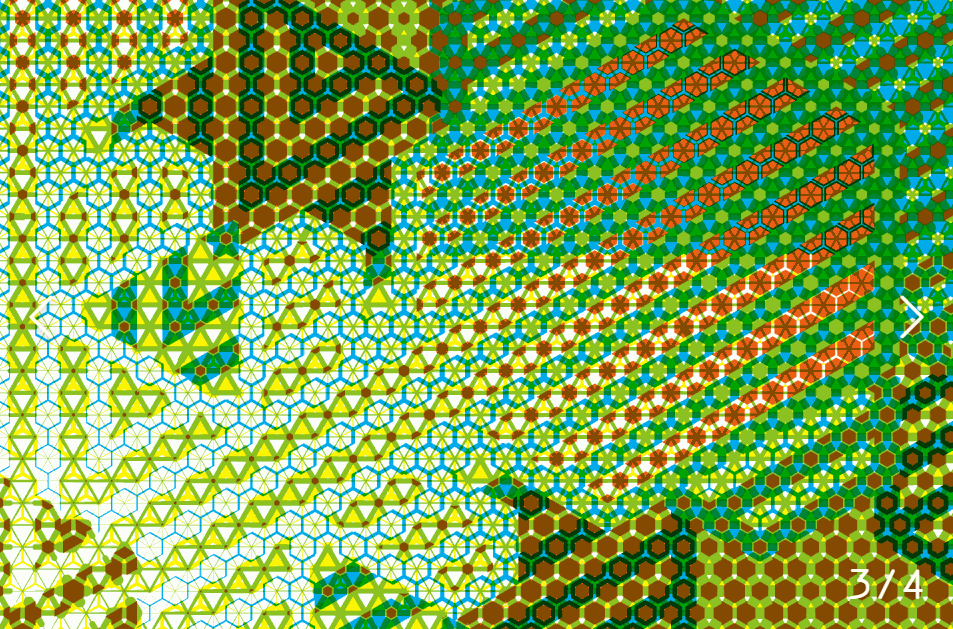
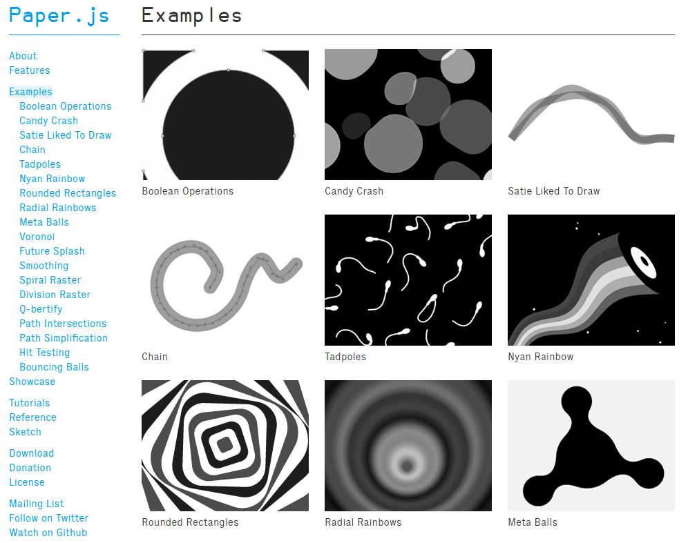
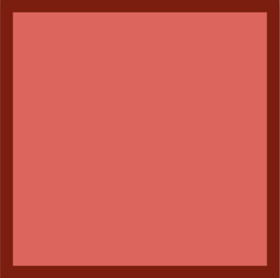
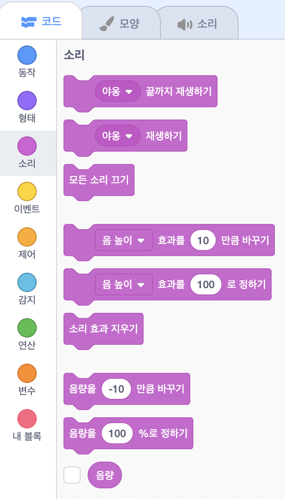
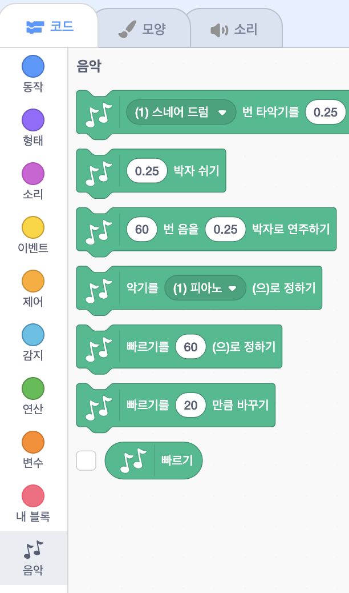
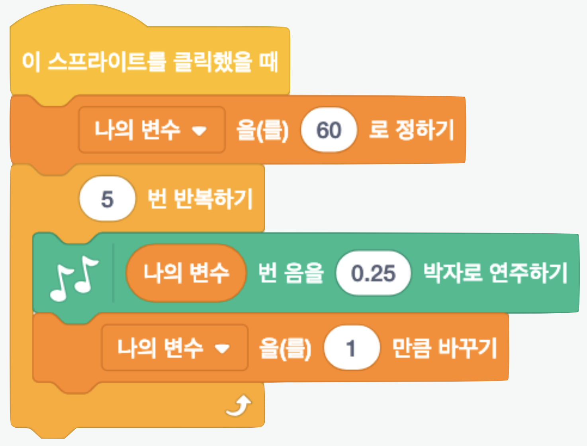
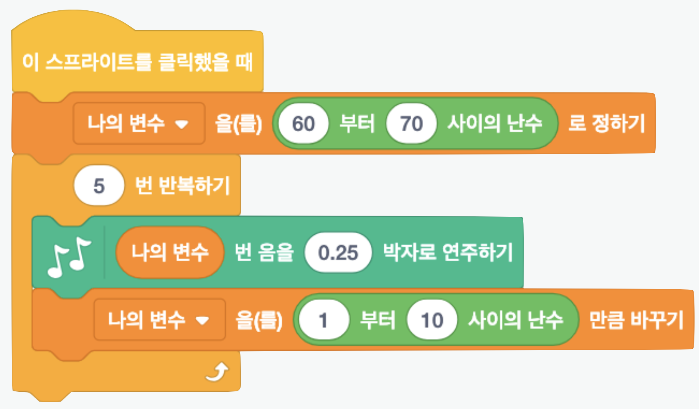

<!--
_class: lead
_paginate: false
-->
# **창의 컴퓨팅 입문**
###### Week 07 : Generative Sound 

---
## 목차
* 지난 시간 리뷰
* 스크래치 아이디 만들기
* 소리만물상자
* 2차원 악기
* 즉흥합주
* 중간놀이 안내

---
## 지난 시간 리뷰
* 워밍업 퀴즈
* 구조의 발견
* 변주 &rarr; [프로젝트 둘러보기](https://docs.google.com/presentation/d/1PT0Hz6L0V0WB47dFaTSp_4e0cDUwRmUJMf833YkbXzc/edit#slide=id.g203b8932380_0_84)

---
## 지난 시간에 한 작업은, 
* 직접 손으로 그림 그리기
* 손으로 그린 과정을 그대로 컴퓨터에게 시키기
* **컴퓨팅의 구조**를 이용하여 자동화하기
* **자동화한 구조**에 내가 예상하기 힘든 변주를 넣기

---
## 제너러티브 디자인 Generative Design
* 자동화한 구조를 사용하여 디자인 하는 것
* 같은 행위의 무한 반복과 이로 인해 발생하는 우연의 결과에 주목
* 컴퓨터 기술과 프로그래밍을 이용
* 조건부 디자인 Conditional Design 과 유사점/차이점은?

---
## [Scriptographer](https://juerglehni.com/works/scriptographer)

---
## [Paper.js](http://paperjs.org/)

[mouse interaction](http://paperjs.org/features/#mouse-interaction)

---
<!--
_class: lead
_paginate: false
-->
# 스크래치 아이디 만들기

---
## 스크래치 아이디 만들기
* https://scratch.mit.edu/
* 스크래치 가입 &rarr; 사용자이름(ID), 패스워드 등 입력
* 입력한 이메일로 확인 메일을 받아서 확인하기 &rarr; 스크래치 기능을 모두 사용할 수 있음(프로젝트 공유!)

---
## 내 작업실 탐험하기
* 다음 사항을 찾아봅시다. 
  - 프로젝트를 어떻게 저장하나요?
  - 저장한 프로젝트를 어떻게 공유하나요?
  - 공유한 프로젝트 링크는 어디서 확인할 수 있나요?
  - 그 밖에, 새로 발견한 내용이 있나요?

---
<!--
_class: lead
_paginate: false
-->
# 소리만물상자

---
## 소리만물상자

---

## 관찰하기 - 소리
* 소리 탭에서 새로운 소리 추가

---

## 관찰하기 - 음악
* 확장기능 &rarr; 음악 추가

---
## [활동] 실험하기 - 기본 소리 만들기
* 준비 : 2명이 1팀 (드라이버 + 네비게이터), PC 1대
* 규칙 : 역할을 바꾸며 다음을 2번 반복하기
  - 소리의 종류, 음 높이, 악기 종류, 빠르기 등을 바꾸기
  - 일정한 변화를 만들기 : 변수를 활용하자!
    - 나의 변수를 1 만큼 바꾸기
    - 나의 변수를 1 로 정하기

---
## [활동] 실험하기 - 기본 소리 만들기의 구조

---
## [활동] 실험하기 - 랜덤 소리 만들기
* 준비 : 2명이 1팀 (드라이버 + 네비게이터), PC 1대
* 규칙 : 역할을 바꾸며 다음을 2번 반복하기
  - 소리의 종류, 음 높이, 악기 종류, 빠르기 등을 바꾸기
  - 무작위한 변화를 만들기 : 변수와 난수를 활용하자!
    - 나의 변수를 (1 부터 10 사이의 난수) 만큼 바꾸기
    - 나의 변수를 (1 부터 10 사이의 난수) 로 정하기

---
## [활동] 실험하기 - 랜덤 소리 만들기의 구조

---
<!--
_class: lead
_paginate: false
-->
# 2차원 악기

---
## 관찰하기
* 소리로 드로잉을 하는 작업들 혹은 그 반대의 작업들
  - https://scratch.mit.edu/projects/155163819/
  - https://scratch.mit.edu/projects/155164944/
  - https://scratch.mit.edu/projects/155165250/
  - https://scratch.mit.edu/projects/285731064/

---
## [활동] 실험하기 - 2차원 악기
* 준비 : 2명이 1팀 (드라이버 + 네비게이터), PC 1대
* 규칙 : 역할을 바꾸며 다음을 2번 반복하기
  - 드로잉 요소와 소리 요소를 하나씩 정하기
  - 드로잉 요소가 소리를 변화시키거나, 
  - 소리 요소가 드로잉 요소를 변화시키기
* 도움말 
  - 지난 시간의 작업이 화면을 종이처럼 사용했다면, 이번에는 화면을 악기처럼 사용해보기

---
## [활동] 실험하기 - 2차원 악기 x 메이키메이키
* 준비 : 2명이 1팀 (드라이버 + 네비게이터), PC 1대, 메이키메이키, 공작도구
* 규칙 : 메이키메이키를 이용하여 컴퓨터 외부의 사물과 연결되는 악기 만들기
* 도움말
  - 기존의 악기 형태와 비슷하지만 다르게 연주할 수 있을까?
  - 2명이 함께 연주할 수 있을까?
  - 다양한 사물, 사람과 연결할 수 있을까?
  - 전혀 예상하지 못한 행동이나 소리를 만들 수 있을까?

---
<!--
_class: lead
_paginate: false
-->
# 즉흥합주 jam

---
## [활동] 즉흥합주
* 준비 : 4명이 1팀, PC 2대, 메이키메이키, 공작도구
* 주제 : 2차원 악기 2개를 활용하여 즉흥합주하기
* 규칙 
  - 대중적인(일반적인) 리듬과 연주 방법은 지양한다.
  - 어색하고 생소하지만, 어떤 규칙이 담기도록 연주한다.

---
## [활동] 즉흥합주
* 프로젝트 문서 작성하기
  - 작품을 잘 소개할 수 있는 제목을 지어주세요.
  - 작품을 소개하는 글을 간단하게 작성해 주세요.
  - 작품 제작 과정을 보여주는 사진과 코드 사진을 찍어주세요.
  - 공유한 프로젝트 주소를 입력해 주세요.
* 작품 소개 영상(30초 내외)을 촬영해서 업로드 해주세요.
* 개인 회고 작성하기

---
## 중간놀이 안내
*  다음 주는 중간놀이가 진행됩니다.
* 3~4명이 1조를 이루게 되고 랜덤으로 팀구성이 됩니다.
* 팀 구성원은 모두 동일한 점수를 받게 됩니다.
* 평가는 동료 및 교수자 평가로 이뤄집니다.
* 미리 준비할 것은 없습니다. 단, 집중할 수 있는 좋은 컨디션으로 다음 수업에 참여하면 됩니다!

---
<!--
_class: lead
_paginate: false
-->
# Thanks! 🎉 

수업 관련하여 궁금한 사항은 
이메일, 수톡, 이클래스 쪽지 등으로 연락주세요.