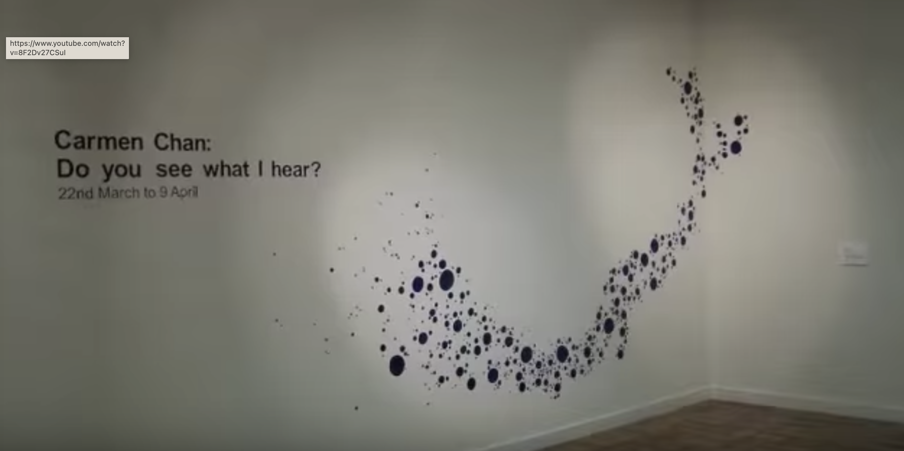
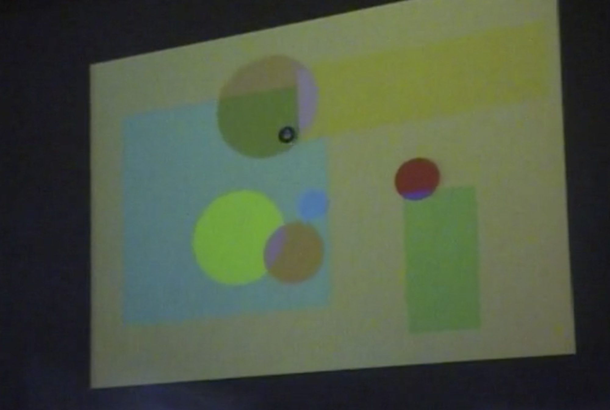

<!--
_class: lead
_paginate: false
-->
# **창의 컴퓨팅 입문**
###### Week 08 : Mid Play

---
## 목차
* 지난 시간 리뷰
* 중간놀이 설명('20)
* 중간놀이('90)
* 정리와 마무리('30)

---
## 지난 시간 리뷰
* 소리만물상자 &rarr; 소리를 스스로 만드는 알고리즘
* 2차원 악기 &rarr; 소리와 드로잉의 상호작용
* 즉흥합주 &rarr; [프로젝트 둘러보기](https://docs.google.com/presentation/d/1p1kDBNFxQIijpDQqBXIXYWnGnDUCFb6OqjifMjiPeZE/edit?usp=sharing)

---
<!--
_header: ""
_footer: ""
-->

[Experimental music notation resources](https://llllllll.co/t/experimental-music-notation-resources/149)

---
<!--
_header: ""
_footer: ""
-->

[The Notations 21 Project](https://www.youtube.com/watch?v=8F2Dv27CSuI)

---
<!--
_header: ""
_footer: ""
-->

[MUSIC and IMAGE in INTERACTION MEDIA ART “SMALL FISH”](https://vimeo.com/146218444#t=2460s)

---
<!--
_class: lead
_paginate: false
-->
# 중간놀이 소개 - 규칙, 평가, 결과물

---
## 중간놀이 규칙
* 준비 : 임의의 3인 1팀
  - PC + 스크래치 + 메이키메이키 + 다양한 재료 + 여러분의 상상력
* 규칙
  - 이전 작품 제작 활동과 거의 동일합니다.
  - 중간놀이 중에도 다른 팀 동료 또는 교수자에게 질문이 가능합니다. 
  - 주어진 시간 내에 완료해야 합니다.
* [공동작업의 팁?!](https://docs.google.com/document/d/16nxW4bGMWi_oR9xoQuDR5MHch51vg62XoeF9ojfgvdQ/edit)

---
## 중간놀이 평가
* 동료 평가 / 팀 멤버는 모두 동일한 점수
  - 동료 평가 요소
    1. 아이디어의 **독창성** : 기존의 익숙함에서 얼마나 벗어나있나?
    2. 주제와 내용의 **공감성** : 작품의 의도가 잘 전달되고 공감되는가?
    3. **재미** : 재미있는가?
  - 교수자 평가 요소 : 위 평가 요소 + 추가 요소 
    1. 컴퓨팅의 구조(반복, 변수)가 포함되었는가?
    2. 메이키메이키를 사용하였는가?

---
## 중간놀이 결과물
* 프로젝트 문서 작성하기
  - 아이디어 스케치
  - 작품 소개 (제목, 소개글, 사진과 코드 사진, 프로젝트URL, 회고) 
  - 작품데모영상(30초 내외)을 촬영해서 업로드 해주세요.
* 주의!! 프로젝트 문서에 스크래치 프로젝트와 소개 영상이 제대로 보이는지 꼭 확인하세요!

---
<!--
_class: lead
_paginate: false
-->
# 중간놀이 주제

---
## 중간놀이 주제 
* 주제 : **낯선 감각**을 다루는 **몸 놀이**
  - 드로잉 / 사운드 / 메이키메이키를 이용하여 놀이를 만든다. 
  - 놀이가 반드시 게임이 될 필요는 없다.
  - 기존의 놀이에서 영감을 받는 것은 괜찮지만,
  - 익숙한 방식으로만 만드는 것은 지양한다

---
## 중간놀이 주제 - 자세히
* 범주를 먼저 생각해 보자.
  - 시각, 청각, 촉각, (후각, 미각)
  - 장소, 대상, 상황...
  - 머리, 손, 발, 등, 배...
* 놀이란, (by 요한 호이징가)
  - 어떤 규칙을 따르지만, (그러나 게임처럼 명확하진 않기도..) 심각하지 않고, 일상을 벗어난 행동이며, 돈을 벌려고 하는게 아니지만(실용적일 필요가 없다는 것),재미가 있다.
* 재미있는 놀이란, 내가 즐겁게 놀 수 있다면, 다른 사람들도 즐길 수 있다.

---
<!--
_class: lead
_paginate: false
-->
# Thanks! 🎉 

수업 관련하여 궁금한 사항은 
이메일, 수톡, 이클래스 쪽지 등으로 연락주세요.