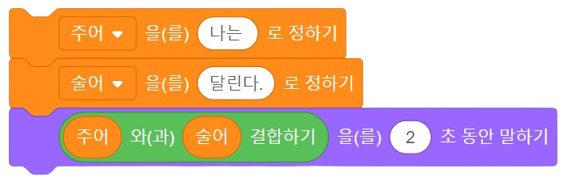
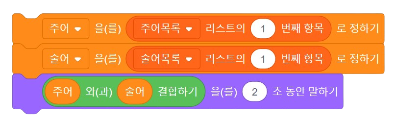
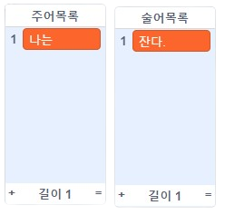
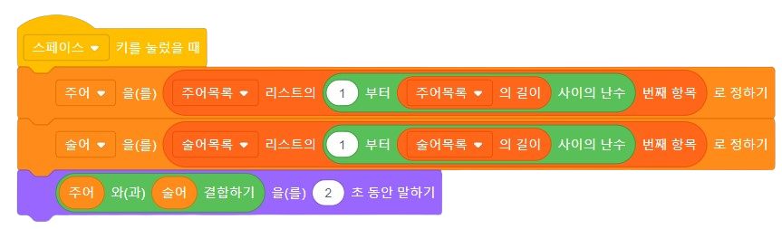

<!--
_class: lead
_paginate: false
-->
# **창의 컴퓨팅 입문**
###### Week 09 : Generative Poem

---
## 목차
* 중간놀이 평가
* 생성적 시쓰기 핸즈온

---
<!--
_class: lead
_paginate: false
-->
# 중간놀이 평가

---
## 중간놀이 평가
* 동료 평가 / 팀 멤버는 모두 동일한 점수
  - 동료 평가 요소
    1. 아이디어의 **독창성** : 기존의 익숙함에서 얼마나 벗어나있나?
    2. 주제와 내용의 **공감성** : 작품의 의도가 잘 전달되고 공감되는가?
    3. **재미** : 재미있는가?
  - 교수자 평가 요소 : 위 평가 요소 + 추가 요소 
    1. 컴퓨팅의 구조(반복, 변수)가 포함되었는가?
    2. 메이키메이키를 사용하였는가?

---
## 평가를 하기 앞서,
다른 사람의 반응에 신경쓰지 마세요.
본인의 **마음을 움직이는 부분** 에 집중하세요.
못한 부분보다 **가능성과 장점**을 보려고 노력해 보세요.
다음에 설명하는 '평가 요소'에 대해 깊게 생각해 보고, **자신만의 기준**을 세워 봅시다.
평가 요소를 구분은 했지만, 모든 사람이 똑같은 가치로 평가할 필요는 없습니다.

---
## 중간놀이 평가 방법
* 준비 : 기록할 종이 1장, 필기도구
* 규칙
  - 해당 팀의 작품 노트와 소개 영상을 시청하면서, 
  - 평가 요소(독창성, 공감성, 재미)에 따른 점수(각 4점 만점)를 부여합니다.
  - 작품을 살펴보면서, 이전에 평가한 점수를 수정할 수 있습니다. 

---

## 평가 요소, 자세히
* 아이디어의 **독창성** (1~4)
  - 기존의 익숙함 보다 다른 관점을 보여주는가?
  - 시도가 신선하고 새로운가?
* 주제와 내용의 **공감성** (1~4)
  - 작품의 주제와 내용이 공감되는가?
  - '낯선 감각의 몸 놀이' 라는 주제와 얼마나 일치하는가?
* **재미** (1~4)
  - 재미있는가? 직접 해보고 싶은가?
  - 작품이 놀이가 되기에 적합한가?

---
<!--
_class: lead
_paginate: false
-->
# 생성적 시쓰기 핸즈온

---
## 실험하기 - 문장의 시작
* 주어 + 술어

---
## 실험하기 - 변수에 담기
* 주어 + 술어를 변수에 담기

---
## 실험하기 - 리스트에 담기
* 주어 + 술어를 리스트에 담기

---
## 관찰하기
* 목록에 있는 단어를 랜덤하게 꺼내는 방법

---
## 이 구조(아이디어)로 무엇을 더 할 수 있을까?
* 주어 + 목적어 + 술어
* 주어 + 형용사 + 목적어 + 술어
* 형용사 + 주어 + 형용사 + 목적어 + 부사 + 술어
* 문장 + 문장 + ...

---
<!--
_class: lead
_paginate: false
-->
# 스캣 Scat
: 가사 대신 뜻이 없는 말로 즉흥적으로 흥얼거리는 것

---

## 스캣 만들기
* 준비 : 2명이 한 팀
* 규칙
  - 노래를 부르는 스캣
  - 나의 미래를 점치는 스캣
  - [하이쿠](https://mangmangdy.tistory.com/145) 스캣
  - 엉뚱하고 재미있는 스캣을 만들어 봅시다.

---
## 스캣 만들기
* 프로젝트 문서 작성하기
  - 작품을 잘 소개할 수 있는 제목, 작품을 소개하는 글, 작품 제작 과정을 보여주는 사진과 코드 사진 추가
* 개인회고 작성

---
<!--
_class: lead
_paginate: false
-->
# Thanks! 🎉 

수업 관련하여 궁금한 사항은 
이메일, 수톡, 이클래스 쪽지 등으로 연락주세요.