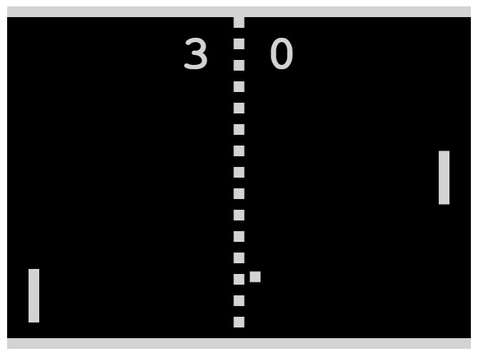
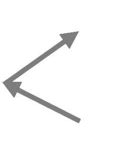
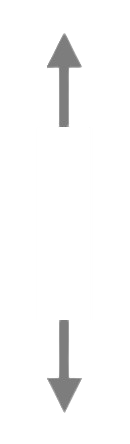
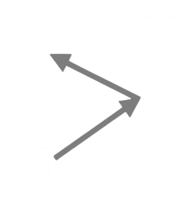
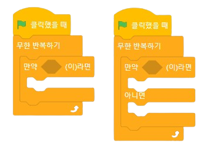
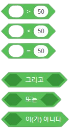

<!--
_class: lead
_paginate: false
-->
# **창의 컴퓨팅 입문**
###### Week 10 : Logic

---
## 목차
* 지난시간 리뷰
* 세상을 바꾼 디지털 유산
* 흉내내기
* 논리의 발견
* Pong 이라는 밈(meme)
* 확장하기

---
## 지난시간 리뷰
* 생성적 시쓰기 핸즈온

---
<!--
_class: lead
_paginate: false
-->
# 세상을 바꾼 디지털 유산

---
## 디지털 문화 유산 관찰하기
* 준비 : 2명이 1팀, 노트북 1대
* 규칙
  - 경건한 마음을 갖기 :)
  - 잠시 이 시대(1970년대)의 관점을 가져보도록 노력하기
    - [Daily Life and Popular Culture in the 1970s](https://youtu.be/Dib8UOKBu4I?t=296)
    - [온통추억 70년대 과학│최-신 기술 컴퓨우-터 등장 │ 대한뉴스](https://youtu.be/oIJ69gEYlMc)
  - 어린마음!

---

## [www.ponggame.org](www.ponggame.org)

---
<!--
_class: lead
_paginate: false
-->
# 흉내내기

---
## Pong 을 설명하는 언어
* 이 게임을 모르는 사람에게 설명한다면?
  - 부모님, 조카 등 아무것도 모르는 사람에게 이 게임을 설명한다고 생각해 봅시다.

---
## 흉내내기
* 준비 : 2명이 1팀, 노트북 1대, A4, 필기도구 등
* 규칙
  - 방금 플레이한 Pong 을 다시 살펴보고, 
  - 지금까지 여러분이 경험한 스크래치로 만들어 봅시다.
  - 모든 것을 똑같이 만들 필요는 없지만, 
  - 가장 핵심이 되는 부분부터 시작해 보세요.
  - 네비게이터는 어려움이 있는 부분을 기록해 주세요.

---
### 공유와 리믹스
* 네비게이터는 "자유롭게" 이동하며 다른 팀의 시도를 봅니다.
* 고민하던 어려움을 다른 팀에서는 어떻게 해결했는지 찾아보세요.
* 또는, 고민하는 어려움을 우리 팀에서 해결했다면, 알려주세요.
* 새롭게 얻은 아이디어는 자신의 팀에 적용해 보세요.

---
<!--
_class: lead
_paginate: false
-->
# 논리의 발견

---
## Pong 을 설명하는 언어
* 가장 핵심이 되는 동작을 생각해 봅시다.
  - 게임에서 등장하는 것(스프라이트)는 무엇인가요?
  - 어떤 것(스프라이트)을 어떻게 해야 움직일 수 있나요?
  - 어떻게 해야 게임에서 이길 수 있나요? / 종료하나요?

---

1. 공
  - 공은 중앙에서 시작한다.
  - 공은 임의 방향으로 움직인다.
  - 만약에 공이 벽에 닿으면, 튕긴다.

---

2. 막대
  - 만약에 키보드의 특정 키를 누르면, 
  - 막대가 위 또는 아래로 움직인다.

---

3. 공과 막대
  - 만약에 공이 막대에 닿으면,
  - 공은 반대 방향으로 튕긴다.

---
4. 점수
  - 공이 막대를 지나가면, 
  - 점수를 1점을 얻는다.
  - 점수가 10점이 되면, 
  - 게임이 종료된다.

---
## 논리를 만드는 구조
  - "만약에 (공이 벽에 닿으면), (튕기기)"
  - "만약에 (위쪽 화살표 키를 누르면), (막대를 위로 움직이기)"
  - "만약에 (공이 막대에 닿으면), (공을 반대 방향으로 튕기기)"
  - "만약에 (공이 막대를 지나가면), (점수를 1점 증가시키기)"
  - "만약에 (점수가 10점이 되면), (게임을 종료하기)"

---

## 논리를 만드는 구조 : 조건문, 조건식

---
<!--
_class: lead
_paginate: false
-->
# Pong 이라는 밈(meme)
meme: 모방을 뜻하는 그리스어 '미메시스(Mimesis)'에서 유래. 사상, 종교, 이념, 관습 등 인간의 삶을 규정하는 다양한 문화 요소들이 유전자의 자기복제처럼 작동하는 일종의 문화 유전자.

---

## Pong 은, 
* 1972년, Atari 회사에서 개발
* 최초로 "상업적으로 성공한" 아케이드 비디오 게임
* 최초 아이디어는 [Magnavox Odyssey](https://youtu.be/jLGBtkKPj2U)
* Pong 게임의 유전자(meme)는 수 많은 게임과 문화에 영향을 끼쳤다.

---
<!--
_class: lead
_paginate: false
-->

### [Breakout - (1976) - Arcade - gameplay HD](https://youtu.be/AMUv8KvVt08)

---
<!--
_class: lead
_paginate: false
-->

### [pong.mythos](https://youtu.be/F4nwzxmr0Qg)

---
<!--
_class: lead
_paginate: false
-->

### [Let's Play - The PainStation](https://youtu.be/6bm7fLcj5UI?t=124)

---
<!--
_class: lead
_paginate: false
-->

### [뉴 게임플레이 New Gameplay - 백남준아트센터](https://youtu.be/HgJ4-4LbsSc?t=110)

---
<!--
_class: lead
_paginate: false
-->
# 확장하기

---
## Pong 의 진화
* 준비 : 2명이 1팀, 노트북 1대, 메이키메이키, 공작도구
* 규칙
  - 반드시 Pong 게임이 될 필요는 없지만, Pong 의 유전자를 계승하여, 전혀 다른 창작물로 만들어 봅시다. (패러디 또는 오마주)
  - 게임이 될 수도 있고, (생성적) 예술 작업이 될 수도 있습니다.
  - 전혀 엉뚱한 의미를 담아도 좋습니다. 
  - 기존 Pong 에는 없는 새로운 "논리 구조" 를 추가해 보세요.
    - 드로잉, 사운드, 시 등등

---
## Pong 의 진화
* 프로젝트 문서 작성하기
  - 작품을 잘 소개할 수 있는 제목, 작품을 소개하는 글, 작품 제작 과정을 보여주는 사진과 코드 사진 추가
* 작품 소개 영상(30초 내외)을 촬영해서 업로드 해주세요.
* 개인회고 작성

---
<!--
_class: lead
_paginate: false
-->
# Thanks! 🎉 

수업 관련하여 궁금한 사항은 
이메일, 수톡, 이클래스 쪽지 등으로 연락주세요.