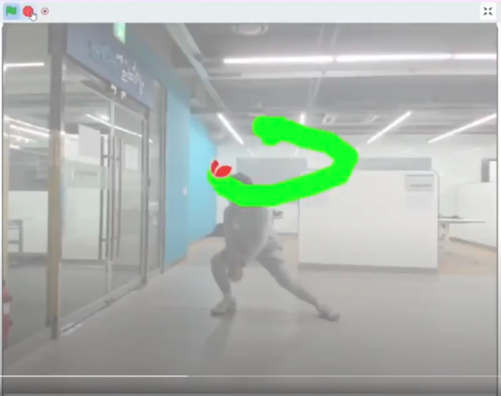
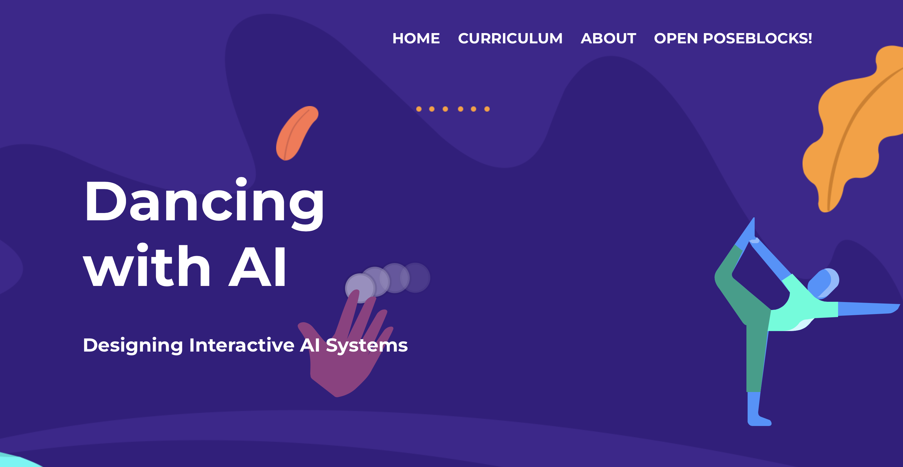
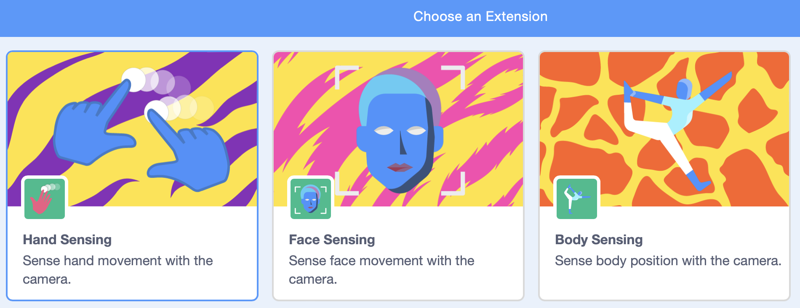
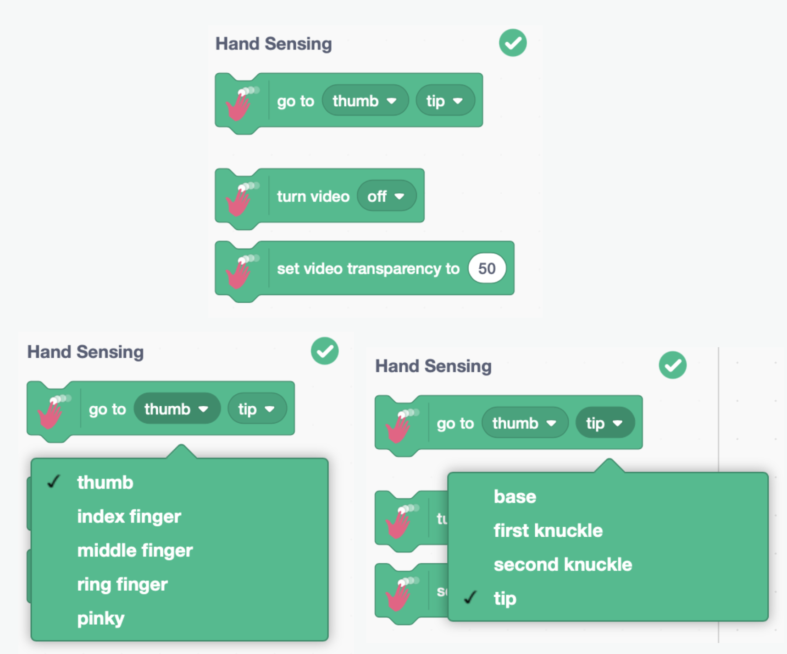
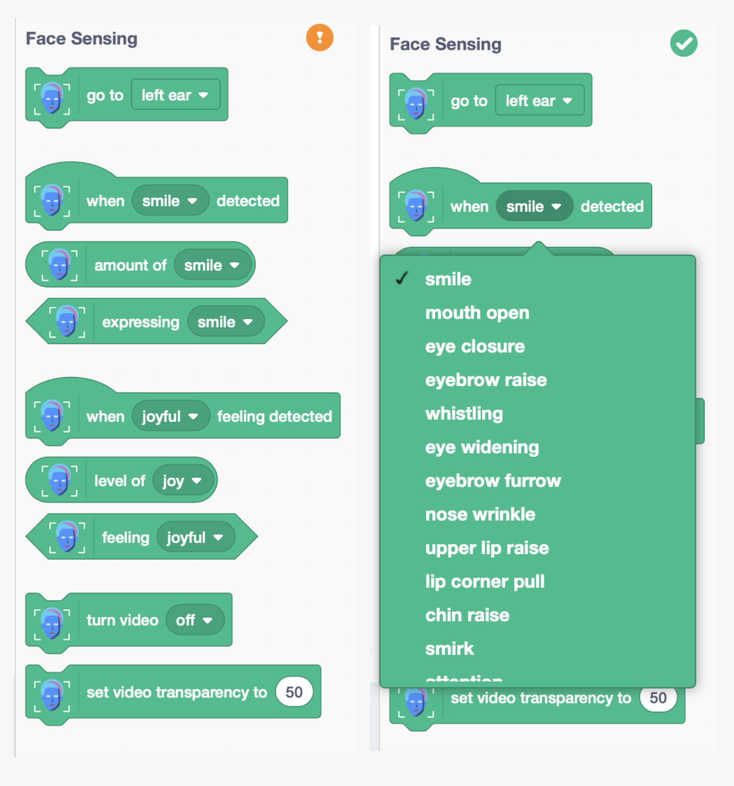
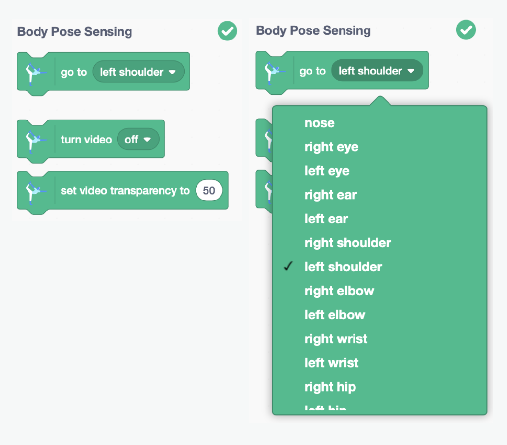
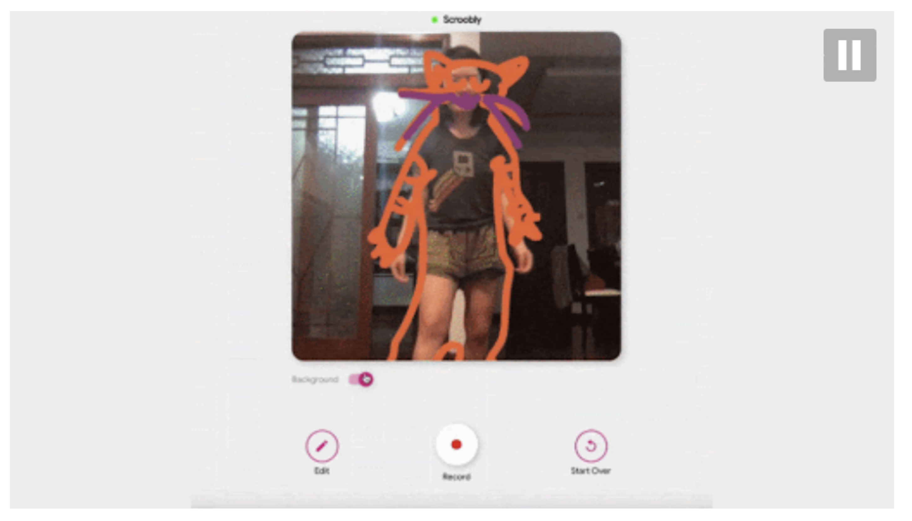
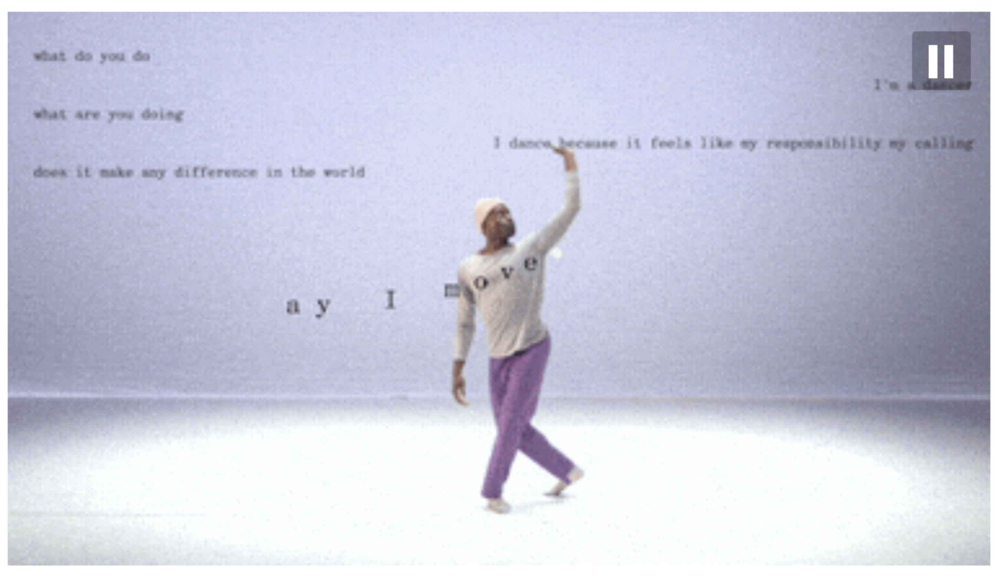
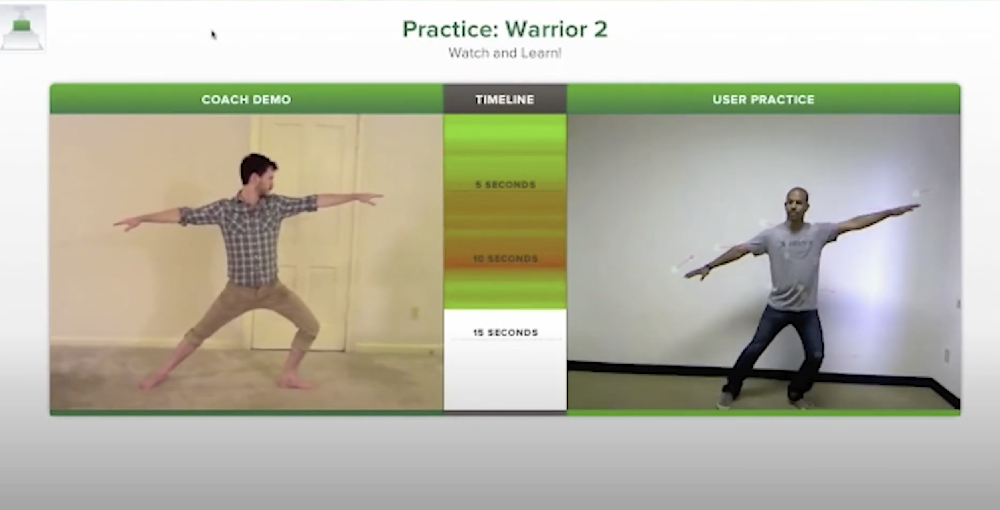

<!--
_class: lead
_paginate: false
-->
# **창의 컴퓨팅 입문**
###### Week 11 : Body Interface

---
## 목차
* 지난시간 리뷰
* 어떤 신체 장치의 시작
* 좀 더 움직여보기
* 인터랙티브 바디 인터페이스
* 확장하기

---
## 지난시간 리뷰
* 세상을 바꾼 디지털 유산
* 흉내내기
* 논리의 발견
* Pong 이라는 밈(meme)
* 확장하기 
  - [game interface](https://gamegeneration.or.kr/?fbclid=IwAR0vL-rzHLmwNtI1jk62GhP2A2JvyuSChozmeJfDcUUjHeyQJzLFkZgtjMU)

---
<!--
_class: lead
_paginate: false
-->
# 어떤 신체 장치의 시작

---
## 새로운 스크래치 관찰하기
* 준비 : 2명이 한 팀, 노트북 1대
* 규칙
  - 오늘은 몸을 사용합니다.
  - 필요하면 책상을 자유롭게 움직일 수 있습니다.
  - 노트북 웹캠의 배경이 벽이 되도록 배치하세요.
---
<!--
_class: lead
-->

## [Body Sign](https://drive.google.com/file/d/14K7_aU1lk6xwMu3KoEjQpIuSL_LftgVk/view?resourcekey)

---
## Body sign
* 스타터 코드 다운로드 [링크](https://www.dropbox.com/scl/fi/a4ikiwgd6gbxymprsjid1/Complete-Code-body-sign.sb3?rlkey=2125b1py29atwg49229o3ndsu&dl=0)
* Dancing with AI 에서 프로젝트 가져오기
* 동작시켜보기
* 나만의 body sign 만들기

---

## https://dancingwithai.media.mit.edu

---

## Dancing with AI
* OPEN POSEBLOCKS! > Extension
* Hand Sensing
* Face Sensing
* Body Sensing

---

---

---

---

## 기존 프로젝트 읽고 수정하기
* 예제 중 프로젝트 1개 선택
* 실행해보고, 코드를 읽어서 이해해 봅시다.
* 한 가지 기능을 추가해 봅시다.

---
## Dancing with AI
* 공식 스크래치 버전이 아닙니다.
* 기존 스크래치 계정으로 로그인하거나 저장할 수 없어요.
* 파일 > 컴퓨터에 저장하기로 저장해 주세요. 
* 프로젝트가 복잡해지기 시작하면, 예상하지 못하게 멈출 수 있어요. 
* 다음 기능을 추가하거나 테스트 하기 전에 파일로 저장해 놓으세요.

---
<!--
_class: lead
_paginate: false
-->
# 좀 더 움직여보기 

---
## 신체를 자유롭게 더 움직여보기
* 예제 중 1개를 선택하여 동작 과정을 변경해 봅시다. 
* 기존 예제에서 사용한 것 말고 다른 센싱을 사용해 보세요.
  - 몸 / 손 / 얼굴
  - 근사한 작품을 만들지 않아도 되요.
  - 자신의 몸을 최대한 재미있게 사용해 봅시다.
  - 새로운 예제로 만들어도 좋습니다.
* 드로잉, 사운드 등 이전의 생성적 구조를 활용해 보세요.

---
## 공유하기
* 네비게이터는 다른 팀의 시도를 살펴보고, 체험해 봅시다. 
* 돌아와서, 우리의 시도를 더 다양하게 만들어 봅시다.

---
<!--
_class: lead
_paginate: false
-->
# 인터랙티브 바디 인터페이스

---
<!--
_class: lead
_paginate: false
-->

### https://www.scroobly.com/

---
<!--
_class: lead
_paginate: false
-->

### https://www.billtjonesai.com/

---
<!--
_class: lead
_paginate: false
-->

### [The creative interface: connecting art and computer science | Cole Wiley | TEDxLSU](https://youtu.be/4yldLauJOZ4?t=619)

---
<!--
_class: lead
_paginate: false
-->
# 확장하기

---
## Pong 게임 확장하기
* 준비 : 2명이 1팀, 노트북 1대, 메이키메이키 공작도구
* 규칙
  - Pong 게임을 다음 버전 중 하나로 만들어 봅시다.
  - 손을 사용하거나 / 얼굴을 사용하거나 / 몸을 사용하여 확장
  - 우리 몸을 가장 재미있게 사용할 수 있는 방법을 고민해 보세요.
  - 각 블록의 기능적 접근보다는, 움직임을 확장해 봅시다. 
* 프로젝트 문서, 소개 영상, 수업회고

---
<!--
_class: lead
_paginate: false
-->
# Thanks! 🎉 

수업 관련하여 궁금한 사항은 
이메일, 수톡, 이클래스 쪽지 등으로 연락주세요.