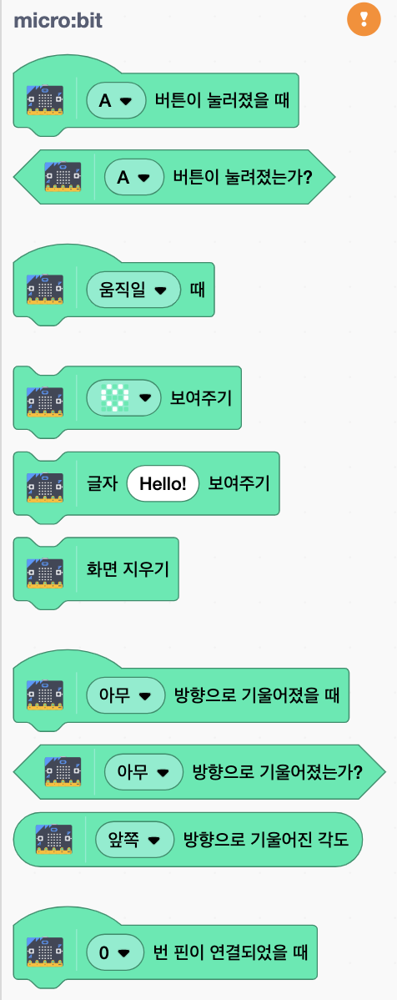
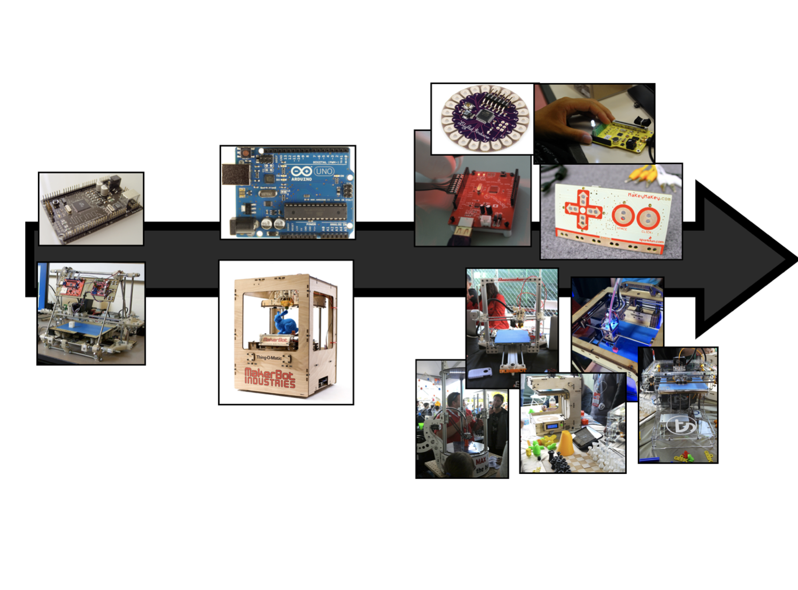
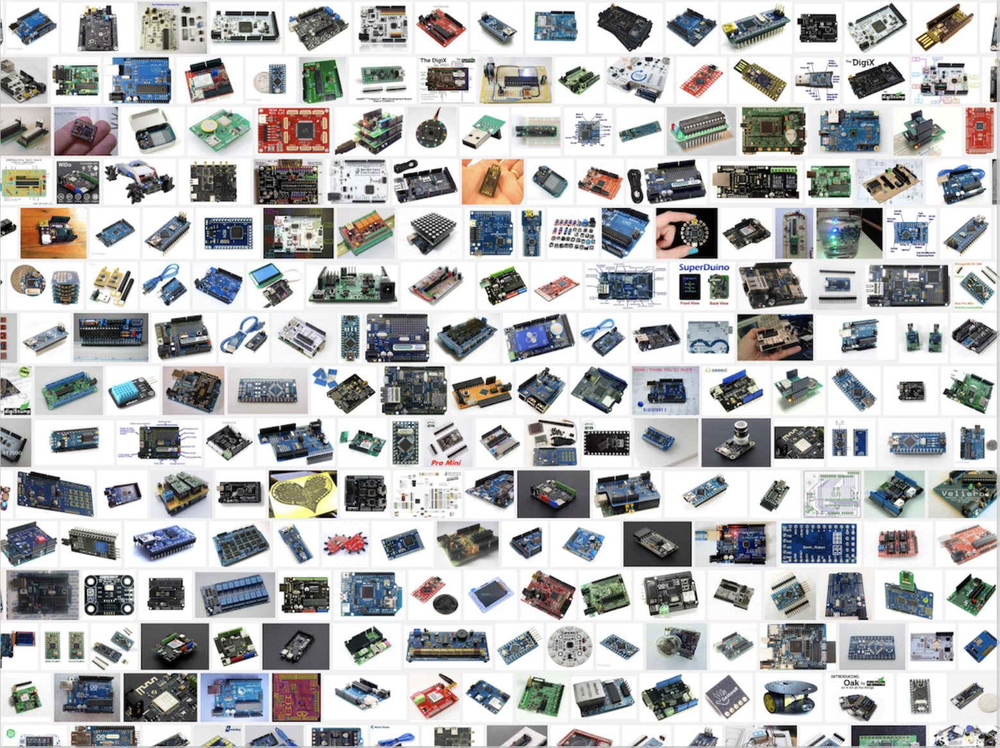
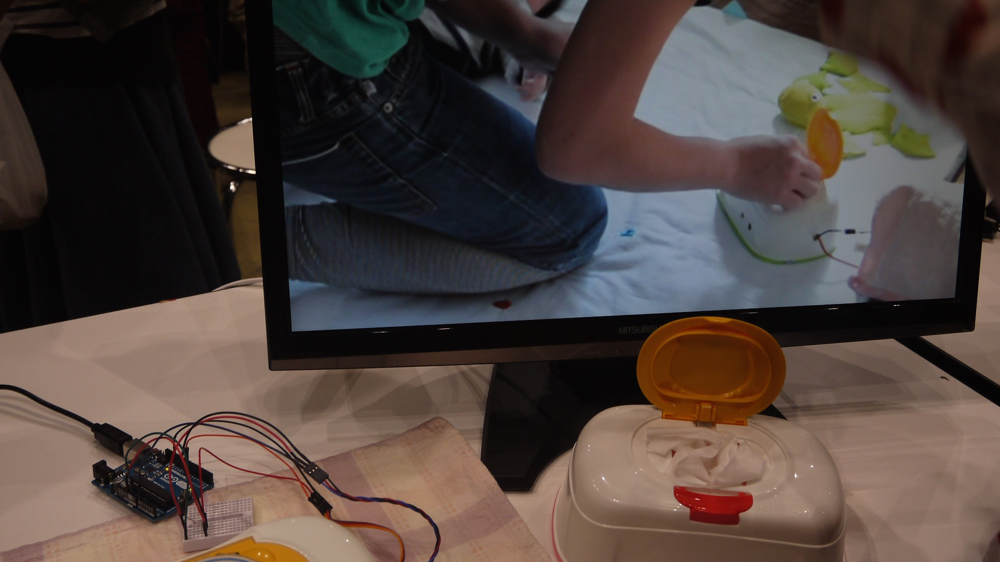

<!--
_class: lead
_paginate: false
-->
# **창의 컴퓨팅 입문**
###### Week 11 : Physical Input Output

---
## 목차
* 지난시간 리뷰
* 어떤 물리적 장치의 시작
* 쓸 데 없는 장치 만들기
* 피지컬 컴퓨팅
* 쓸 데 없는 장치 확장하기

---
## 지난시간 리뷰
* 세상을 바꾼 디지털 유산
* 흉내내기
* 논리의 발견
* Pong 이라는 밈(meme)
* 확장하기

---
<!--
_class: lead
_paginate: false
-->
# 어떤 물리적 장치의 시작

---
## 어떤 장치 (하드웨어)
* 준비 : 2명이 1팀, 노트북 1대, 마이크로비트 키트
* 규칙
  - 마이크로비트 키트를 관찰/탐색 합니다.
  - 구성품을 확인해 봅시다. 
    - 어떤 표시가 있나요? 
    - 어떻게 연결할까요?
  - "어린 마음"으로 어떤 특징이 있는지 찾아봅시다. 

---
<!--
_class: lead
_paginate: false
-->

---
<!--
_class: lead
_paginate: false
-->

---
## 장치를 제어하는 환경 (소프트웨어)
* 스크래치 사이트 > 만들기 > 확장 기능 고르기 > micro:bit 추가
* 도움말 >
  - 1. Scratch Link 설치하기 [링크](https://scratch.mit.edu/microbit)
  - 2. 스크래치 micro:bit HEX 설치하기
    - 2.1 micro:bit를 컴퓨터에 USB 케이블로 연결하세요.
    - 2.2 스크래치 micro:bit HEX 파일을 다운로드하세요. [링크](https://downloads.scratch.mit.edu/microbit/scratch-microbit.hex.zip)
    - 2.3 micro:bit에 HEX 파일을 옮겨다 놓으세요.
  - 3. Scratch Link 실행 > 스크래치 만들기에서 마이크로비트 연결

---
<!--
_class: lead
_paginate: false
-->

---
## 잘 연결되었나요?
* 입력과 관련된 장치를 하나 골라서 동작시켜 보세요.
* 출력과 관련된 장치를 하나 골라서 동작시켜 보세요.

---
<!--
_class: lead
_paginate: false
-->
# 쓸 데 없는 장치 만들기

---
## 쓸 데 없는 장치 - 첫번째 시도
* 준비 : 2명이 1팀, 노트북 1대, 마이크로비트 키트, 공작도구
* 규칙
  - 하나의 입력장치와 하나의 출력장치를 고르고,
  - 둘 사이의 어떤 "작용"을 만들어 보세요.
  - 그리고 해당 작용으로 가능한 "이야기"를 상상해 보세요.

---
## 공유와 리믹스
* 규칙
  - 네비게이터는 다른 팀의 시도를 살펴보세요.
  - 다른 팀의 시도를 보면서 질문을 하거나 도움을 주세요.
  - 팀으로 돌아와서 새롭게 얻은 아이디어를 적용해 보세요.

---
<!--
_class: lead
_paginate: false
-->
# 피지컬 컴퓨팅

---
<!--
_class: lead
_paginate: false
-->

---
<!--
_class: lead
_paginate: false
-->

## 아두이노 Arduino
### '강력한 친구'

---
<!--
_class: lead
_paginate: false
-->

---
<!--
_class: lead
_paginate: false
-->

---
<!--
_class: lead
_paginate: false
-->

---
<!--
_class: lead
_paginate: false
-->

### [Mjölnir 묠니르](https://www.youtube.com/watch?v=0_8Xhzt5YQI)

---
<!--
_class: lead
_paginate: false
-->

### [‘아기 기저귀를 갈 때 물티슈의 뚜껑을 여는게 귀찮은걸...’](https://photos.google.com/share/AF1QipOfvdjGs0EPubl7vpLOAw6yW0XvUi2CCTmzkmB3xYOo_QheU2mWoiHkrzYxSXPU8A?key=dFBGeXgxTkxCVlR5Y3VKczQxVEtUREVCRzJGcWh3)

---
<!--
_class: lead
_paginate: false
-->

### [Instructable Arduino Project](https://www.instructables.com/circuits/arduino/projects)

---
## 컴퓨팅 시스템과 사람은 어떻게 상호작용하나?

---
## 우리 수업의 맥락에서,
* 그동안 익숙하게 느낀 컴퓨터를 의심해보기
* 이 수업은 컴퓨터가 아니라 컴퓨팅을 배웁니다.
* 만약 새로운 (그리고 엉뚱한) 상호작용이 가능하다면? 
* 새로운 인터페이스로 더 즐겁게 컴퓨팅과 놀며 창작할 수 있을까?
* 어떤 (컴퓨팅) 놀이가 가능할까?

---
<!--
_class: lead
_paginate: false
-->
# 쓸 데 없는 장치 확장하기

---
## 쓸 데 없는 장치 - 두번째 시도
* 준비 : 2명이 1팀, 노트북 1대, 마이크로비트 키트, 공작도구
* 규칙
  - 입력장치와 출력장치를 2개 이상 활용하여,
  - 그동안 우리가 놀아봤던 생성적(드로잉 / 사운드 / 시) 작품을 골라,
  - 엉뚱한 장난(놀이), 쓸 데 없는 장치를 만들어 봅시다.
  - 표현이 간단하더라도, 개인적인 이야기를 담아 봅시다.

---
## 쓸 데 없는 장치 - 두번째 시도
* 프로젝트 문서 작성하기
  - 작품을 잘 소개할 수 있는 제목, 작품을 소개하는 글, 작품 제작 과정을 보여주는 사진과 코드 사진 추가
* 작품 소개 영상(30초 내외)을 촬영해서 업로드 해주세요.
* 개인회고 작성

---
<!--
_class: lead
_paginate: false
-->
# Thanks! 🎉 

수업 관련하여 궁금한 사항은 
이메일, 수톡, 이클래스 쪽지 등으로 연락주세요.