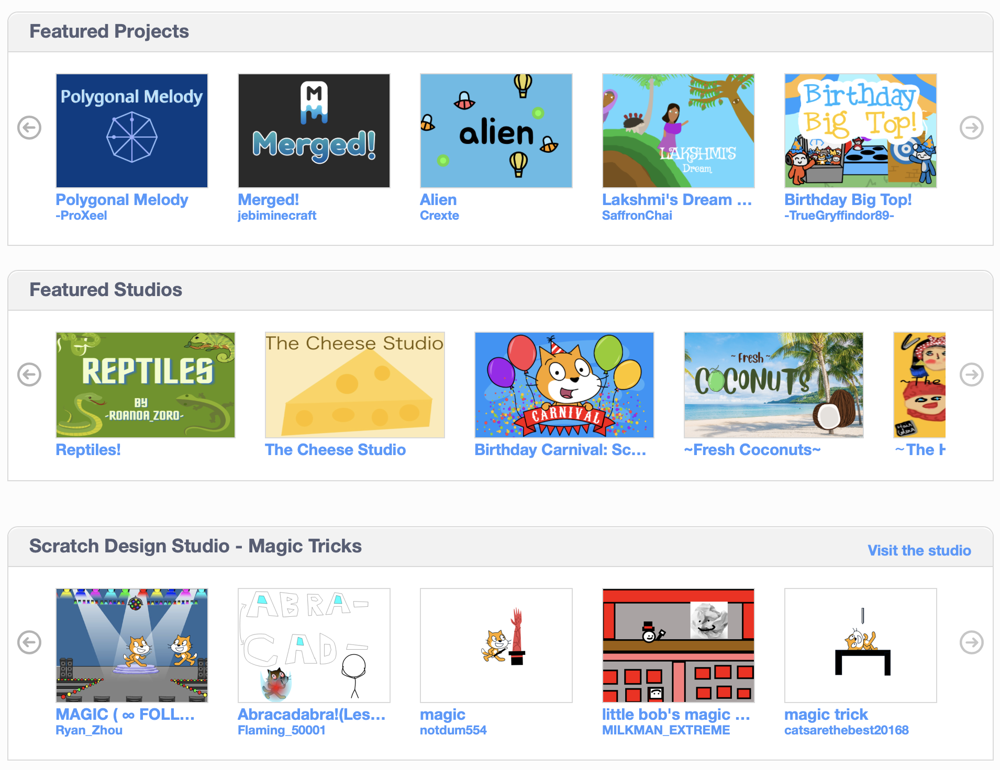
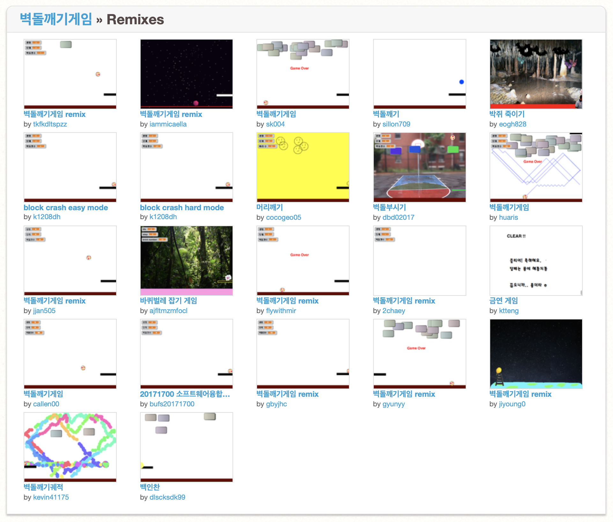

<!--
_class: lead
_paginate: false
-->
# **창의 컴퓨팅 입문**
###### Week 13 : Remix & Share

---
## 목차
* 지난시간 리뷰
* 리믹스 : 스크래치 저장소
  - [활동] 다시, 코드 리터러시!
  - [활동] 리믹스 하기
* 라이선스와 오픈소스
* 디지털 시대의 공유

---
## 지난시간 리뷰
* 씨앗 읽기
* 씨앗 확장하기
* 리믹스
* 읽고 쓴다는 것의 의미 : 리터러시

---
<!--
_class: lead
_paginate: false
-->
# 지난시간 리뷰

---
## 디지털 시대의 리터러시
* 프로그램 코드를 읽고 쓴다는 것은 어떤 의미일까?
* 다른 사람의 코드를 써도 될까?
* 다른 사람의 코드와 내가 작성한 코드가 섞인 결과물, 이 결과물은 누구의 것일까?

---
<!--
_class: lead
_paginate: false
-->
# 리믹스: 스크래치 저장소

---
<!--
_class: lead
_paginate: false
-->

# [scratch.mit.edu](https://scratch.mit.edu)
## 커뮤니티: 아이디어 (코드) 저장소

---
<!--
_class: lead
_paginate: false
-->

# [프로젝트 리믹스](https://scratch.mit.edu/projects/11236697/remixes/)

---
## [활동] 다시, 코드 리터러시!
* [씨앗 스튜디오](https://scratch.mit.edu/studios/4344136/)
* 규칙
  - 여러개의 씨앗 중에서 관심이 가는 씨앗 **2개**를 고르기
  - 각 씨앗별로 동작(코드) 이해하여 기록하기
    - 반복문은 어떻게 쓰였지?
    - 변수/난수는 어떤 용도로 사용되고 있을까?
    - 조건문은 어떤 논리를 나타낼까?
    - 어떻게 확장할 수 있을까?

---
## 함께 읽어보기
* 씨앗들을 함께 살펴봅시다.

---
## [활동] 리믹스 하기
* 씨앗 2개를 섞어 봅시다. 
* 규칙
  - 첫 번째 씨앗을 리믹스하기
  - 두 번째 씨앗의 아이디어 또는 스프라이트 중 마음에 드는 것을 골라 가져오기
  - 단순히 추가하는 것이 아닌, 아이디어를 가져와서 다른 형태, 의미, 과정, 결과로 가져와 주세요.

---
## [활동] 리믹스 하기
* 규칙 (이어서)
  - 다음의 컴퓨팅 구조가 반드시 포함되도록 만듭니다.
    - 난수 / 변수(또는 리스트), 반복문 / 조건문
  - 프로젝트 문서 작성
  - CCL 추가하기

---
<!--
_class: lead
_paginate: false
-->
# 라이선스와 오픈소스

---
## 저작권? 라이선스?
* 저작권 : 창작자가 자기 창작물에 행사할 수 있는 '법적인 권리'
  - 카피라이트 copyright 로고로 표기
* 라이선스 : 창작물에 대한 '사용권'의 개념
  - 사용범위(포함할 콘텐츠 종류, 사용방식 등)를 정하는 것
  - 글, 그림, 음악, 소스코드 등 다양한 형태의 창작물에 부여할 수 있다.
* 자신이 만든 콘텐츠에 라이선스를 부여하는 것은,
곧 '저작권을 행사 하는 것' 이다.

---
## 오픈소스
* 오픈소스란, '원시 코드'에 접근하여 라이선스의 범위 안에서 변형(가공)/공유(배포)할 수 있게 한 SW/HW의 사용권
* [오픈소스 소프트웨어 라이선스 종류](https://codenamu.org/2014/10/10/popular-opensource-license)
* [생활코딩 저작권](https://www.facebook.com/218158748272233/posts/473466639408108/)
* 다양한 라이선스가 있으며, 자기가 라이선스를 직접 만들 수도 있다. (예: [비어웨어](https://en.wikipedia.org/wiki/Beerware))

---
## 라이선스 부여하기
* 자신이 창작한 콘텐츠의 특성에 맞는 라이선스 부여하기
* [CCL 라이선스 부여하기](https://creativecommons.org/choose/?lang=ko)
* [스크래치 프로젝트 리믹스와 복사](https://scratch.mit.edu/faq#remix)

---
<!--
_class: lead
_paginate: false
-->
# 디지털 시대의 공유

---
## 복붙 or 공유
* 거의 모든 컨텐츠가 ctrl+c / v 로 간단히 복제가 가능
원본과 복제본의 차이를 구별 할 수 있을까?
* 하늘 아래 새로운 것은 없다.
우리가 만드는 컨텐츠는 대부분 어느 누군가가 만들어 놓은
토대 위에 만들어 가는 것.
(문자에 대해 누군가가 저작권을 행사하지 않듯이)

---
<!--
_class: lead
_paginate: false
-->

#### [거인의 어깨 위에 올라서는 행운](https://ppss.kr/archives/55132)

---
# 복붙 or 공유
* 그렇다면 오픈소스와 상용 소프트웨어는 서로 적대적일까?
* 현명하게 디지털 콘텐츠를 공유하는 방법은?
  - 사진을 무료로 공개하고 나를 알리자. [unsplash.com](https://unsplash.com/)

---
# 기말놀이
* 중간놀이와 동일하게 진행됩니다.
* 수업시간에 여러분들이 만들었던 코드들을 참고로 할 수 있습니다.
* 평가는 마찬가지로 동료 간 평가와 교수자 평가가 이뤄집니다.
* 가벼운 마음으로 평소 수업시간 하던 대로 하면 됩니다.

---
<!--
_class: lead
_paginate: false
-->
# Thanks! 🎉 

수업 관련하여 궁금한 사항은 
이메일, 수톡, 이클래스 쪽지 등으로 연락주세요.