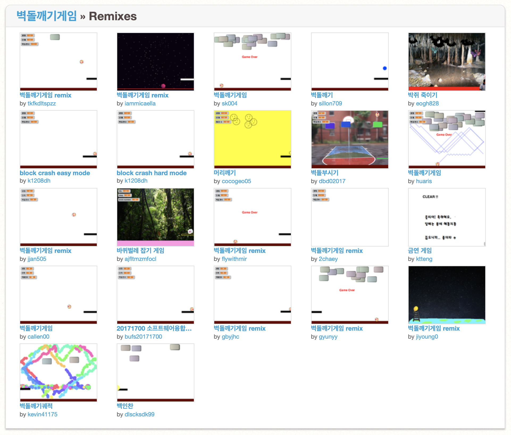

<!--
_class: lead
_paginate: false
-->
# **창의 컴퓨팅 입문**
###### Week 13 : Remix & Share

---
## 목차
* 지난시간 리뷰
* 리믹스 : 스크래치 저장소
* 라이선스와 오픈소스
* 확장하고 공유하기
* 디지털 시대의 공유

---
## 지난시간 리뷰
* 씨앗 읽기
* 씨앗 확장하기
* 리믹스
* 읽고 쓴다는 것의 의미 : 리터러시

---
<!--
_class: lead
_paginate: false
-->
# 지난시간 리뷰

---
## 디지터 시대의 리터러시
* 프로그램 코드를 읽고 쓴다는 것은 어떤 의미일까?
* 다른 사람의 코드를 써도 될까?
* 다른 사람의 코드와 내가 작성한 코드가 섞인 결과물, 이 결과물은 누구의 것일까?

---
<!--
_class: lead
_paginate: false
-->
# 리믹스: 스크래치 저장소

---
<!--
_class: lead
_paginate: false
-->

# [scratch.mit.edu](https://scratch.mit.edu)
## 커뮤니티: 아이디어 (코드) 저장소

---
<!--
_class: lead
_paginate: false
-->

# [프로젝트 리믹스](https://scratch.mit.edu/projects/11236697/remixes/)

---
## [활동] 다시, 코드 리터러시!
* [씨앗 스튜디오](https://scratch.mit.edu/studios/4344136/)
* 규칙
  - 여러개의 씨앗 중에서 관심이 가는 씨앗 **2개**를 고르기
  - 각 씨앗별로 동작(코드) 이해하기
    - 반복문은 어떻게 쓰였지? 
    - 변수/난수는 어떤 용도로 사용되고 있을까?
    - 조건문은 어떤 논리를 나타낼까?
    - 어떻게 확장할 수 있을까?

---
## 함께 읽어보기
* 씨앗들을 함께 살펴봅시다.

---
## [활동] 리믹스 하기
* 씨앗 2개를 섞어 봅시다. 
* 규칙
  - 첫 번째 씨앗을 리믹스하기
  - 두 번째 씨앗의 스프라이트 중 마음에 드는 것을 골라 가져오기
  - 

---
<!--
_class: lead
_paginate: false
-->
# 라이선스와 오픈소스

---
<!--
_class: lead
_paginate: false
-->
# 확장하고 공유하기

---
<!--
_class: lead
_paginate: false
-->
# 디지털 시대의 공유

---
<!--
_class: lead
_paginate: false
-->
# Thanks! 🎉 

수업 관련하여 궁금한 사항은 
이메일, 수톡, 이클래스 쪽지 등으로 연락주세요.