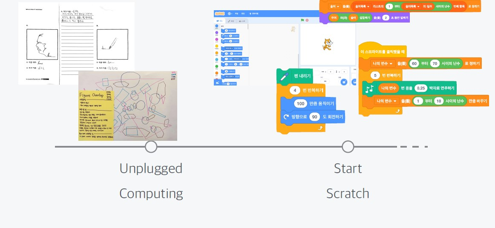
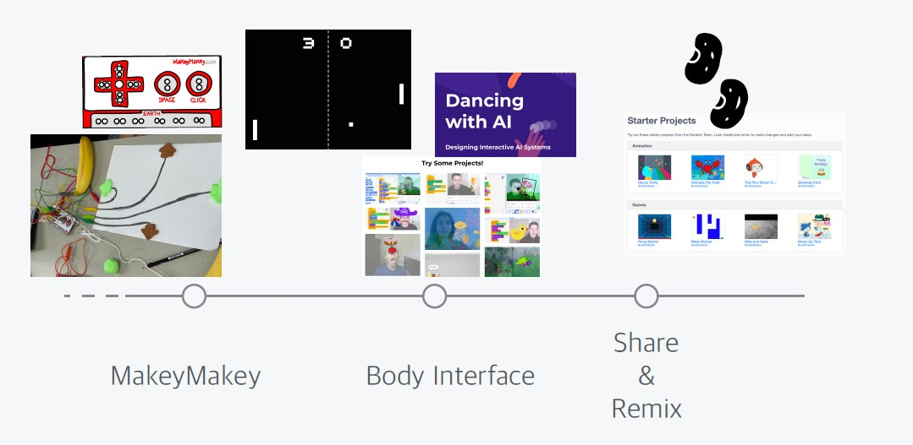

<!--
_class: lead
_paginate: false
-->
# **창의 컴퓨팅 입문**
###### Week 15 : Final Review

---
## 목차
* 지난시간 리뷰
* 기말놀이 평가
* 한 학기 수업 회고

---
<!--
_class: lead
_paginate: false
-->
# 지난시간 리뷰

---
## 기말놀이 주제 
* 주제 : "일상의 재발견"
  - 우리의 일상은 같은 일이 반복되기도 하고, 때로는 서로가 비슷비슷해 보이기도 합니다.
  - 그러나 각자에게는 어떤 영감을 주거나, 감정을 일으키는 일상적이지만 ‘특별한 순간’이 있지요.
  - 그 순간을 소재로 해서 작품을 만들어봅시다.
  - 그 순간을 재현하라는 말이 아닙니다!
  - 놀이, 게임, 드로잉, 사운드, 시 등 다양한 장르가 가능합니다.

---
## 기말놀이 주제 - 씨앗
* 다음 씨앗을 활용하세요.
  - https://scratch.mit.edu/starter_projects/
  - https://dancingwithai.media.mit.edu/
* 씨앗을 활용하는 단계
  1단계 : 스프라이트 모양 바꾸기
  2단계 : 변수, 난수, 블록 위치 바꾸기
  3단계 : 구조를 이해하고 목적에 맞게 바꾸기 

---
<!--
_class: lead
_paginate: false
-->
# 기말놀이 평가

---
## 기말놀이 평가
* 동료 평가 / 팀 멤버는 모두 동일한 점수
  - 동료 평가 요소
    1. 아이디어의 **독창성** : 기존의 익숙함에서 얼마나 벗어나있나?
    2. 주제와 내용의 **공감성** : 작품의 의도가 잘 전달되고 공감되는가?
    3. **재미** : 재미있는가?
  - 교수자 평가 요소 : 위 평가 요소 + 추가 요소 
    1. 컴퓨팅의 구조(반복, 조건, 변수, 난수)가 포함되었는가?
    2. Body Interface를 사용하였는가?

---
## 평가를 하기 앞서,
다른 사람의 반응에 신경쓰지 마세요.
본인의 **마음을 움직이는 부분** 에 집중하세요.
못한 부분보다 **가능성과 장점**을 보려고 노력해 보세요.
다음에 설명하는 '평가 요소'에 대해 깊게 생각해 보고, **자신만의 기준**을 세워 봅시다.
평가 요소를 구분은 했지만, 모든 사람이 똑같은 가치로 평가할 필요는 없습니다.

---
## 기말놀이 평가 방법
* 준비 : 기록할 종이 1장, 필기도구
* 규칙
  - 해당 팀의 작품 노트와 소개 영상을 시청하면서, 
  - 평가 요소(독창성, 공감성, 재미)에 따른 점수(각 4점 만점)를 부여합니다.
  - 작품을 살펴보면서, 이전에 평가한 점수를 수정할 수 있습니다. 

---

## 평가 요소, 자세히
* 아이디어의 **독창성** (1~4)
  - 기존의 익숙함 보다 다른 관점을 보여주는가?
  - 시도가 신선하고 새로운가?
* 주제와 내용의 **공감성** (1~4)
  - 작품의 주제와 내용이 공감되는가?
  - '낯선 감각의 몸 놀이' 라는 주제와 얼마나 일치하는가?
* **재미** (1~4)
  - 재미있는가? 직접 해보고 싶은가?
  - 작품이 놀이가 되기에 적합한가?

---
<!--
_class: lead
_paginate: false
-->
# 한 학기 수업 회고

---

---

---
## 함께 하는 수업 회고
* 한 학기 동안 수업에서,
  **좋았던 점(+)**, 
  **아쉬웠던 점(-)**, 
  **새롭게 알게된 점(!)** 을 
포스트잇에 각각 한 개씩 작성해서 벽에 붙여 봅시다.
* 그리고 함께 살펴 봅시다.

---
<!--
_class: lead
_paginate: false
-->
# Thanks! 🎉 

수업 관련하여 궁금한 사항은 
이메일, 수톡, 이클래스 쪽지 등으로 연락주세요.